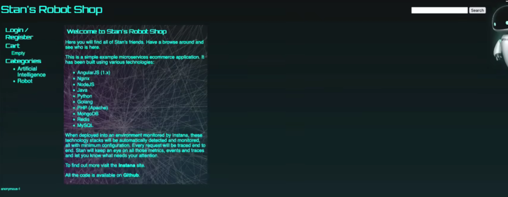

# 🚀 **AWS Three-Tier Microservices Deployment on Kubernetes**

## 🏗️ **Overview**

This project is a **production-grade Three-Tier Application** deployed on **Kubernetes (EKS/AKS)** with a full **DevOps toolchain**.
It is built using a microservices architecture (cart, catalogue, dispatch, payment, shipping, user, etc.) and includes:

* 🧱 **Frontend Tier** — AngularJS + NGINX
* ⚙️ **Backend Tier** — 10+ microservices
* 🗄️ **Data Tier** — MongoDB, MySQL, Redis
* 📩 **Messaging Layer** — RabbitMQ
* 🐳 Full Docker containerization
* ☸️ Kubernetes manifests + Helm Charts
* 🔄 GitHub Actions CI/CD pipelines

This repository is a **complete demonstration** of how to design, build, containerize, deploy, scale, monitor, and automate a cloud-native system.

---

## 📦 **Architecture Diagram**

**Three-tier layout:**

```
                 [ Client / Browser ]
                          |
                          ▼
                   [ Frontend Tier ]
                 AngularJS + NGINX
                          |
------------------------------------------------
                          |
                   [ Backend APIs ]
   cart | catalogue | payment | user | ratings |
     shipping | dispatch | gateway | load-gen
                          |
------------------------------------------------
                          |
                    [ Data Layer ]
    MongoDB | MySQL | Redis | RabbitMQ (MQ broker)
```

---

## 🐳 **Containerization**

Each microservice contains:

* Dockerfile (multi-stage builds where possible)
* Lightweight base image (Alpine / slim variants)
* Environment variable support
* Healthcheck endpoints

**Build all images:**

```bash
docker-compose build
```

**Run locally:**

```bash
docker-compose up -d
```

---

## ☸️ **Kubernetes Deployment**

The repo includes **AKS/EKS-ready Helm charts**:

* `/AKS/helm/Chart.yaml`
* `/AKS/helm/templates/*.yaml`

### 🚀 Deploy using Helm

```bash
helm install robot-shop ./AKS/helm
```

### 🔄 Upgrade deployment

```bash
helm upgrade robot-shop ./AKS/helm
```

### 🧹 Uninstall

```bash
helm uninstall robot-shop
```

---

## 🔧 **CI/CD — GitHub Actions**

Automated pipelines exist for each microservice:

* 🏗️ CI → Build + Test
* 🐳 Image Build → Docker Hub
* ☸️ CD → Deploy to Kubernetes

Workflows located in:

```
.github/workflows/
```

Example stages:

* Linting
* Unit Tests
* Docker Build & Push
* Helm Upgrade / Kubectl Apply
* Notifications

---

## 📊 **Monitoring & Logging**

Integrated support for:

* Prometheus metrics scraping
* ELK / EFK logging stack
* Kubernetes events & pod logs
* Health & readiness probes

---

## 🔥 **Load Testing**

The repo includes a Locust-based load generator:

```
load-gen/
```

Run with:

```bash
docker-compose -f docker-compose.yaml -f docker-compose-load.yaml up
```

---

## 🛡️ **Security Enhancements**

* Secrets via Kubernetes Secrets
* RBAC roles & service accounts
* Network policies
* Isolated namespaces (dev/stage/prod)
* SSL termination with Ingress

---

# **Output**

