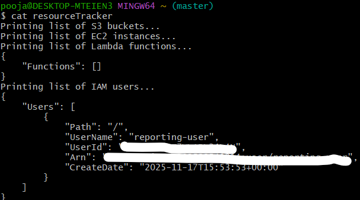
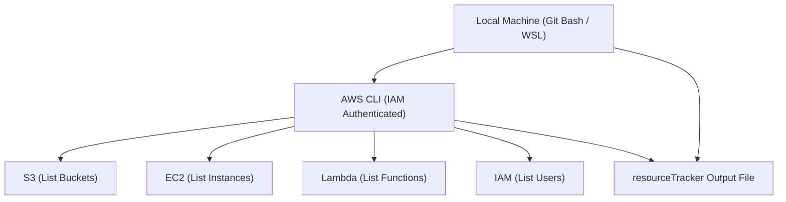

## 🧠 Project Name: AWS-Resource-Usage-Tracker

### 📋 Project Overview

Organizations leveraging AWS often need to monitor their cloud resources daily to ensure cost efficiency and proper management.

This project automates the process of tracking **AWS resource usage** — including **EC2 instances, S3 buckets, Lambda functions, and IAM users** — using a **Bash script** and **cron jobs**.

The script collects resource information daily at a scheduled time and stores it in a report file for audit or analysis purposes.

---

### ⚙️ Technologies Used

* **AWS CLI** — Command-line interface for interacting with AWS services
* **Bash (Shell Scripting)** — Automation scripting
* **jq** — Lightweight JSON processor
* **Crontab** — Task scheduler in Linux

---

### 📁 Project Structure

```
AWS-Resource-Usage-Tracker/
│
├── resourceTracker.sh       # Main shell script
└── README.md                 # Project documentation
```

---

### 🧩 Prerequisites

Before running this project, ensure you have:

1. **AWS CLI installed and configured**

   ```bash
   aws configure
   ```

   Enter your AWS Access Key, Secret Key, and default region.

2. **jq installed**

   ```bash
   sudo apt install jq -y
   ```

   *(or use `brew install jq` on macOS)*

3. **IAM permissions** for your AWS user to:

   * `DescribeInstances` (EC2)
   * `ListBuckets` (S3)
   * `ListFunctions` (Lambda)
   * `ListUsers` (IAM)

---

### 🧠 How It Works

1. The script runs AWS CLI commands to fetch:

   * S3 bucket list
   * EC2 instance details
   * Lambda functions
   * IAM user information
2. Outputs all details into a file named **resourceTracker**
3. Each run appends new data with timestamps for record-keeping
4. Cron job schedules daily execution

---

### 🕒 Automate with Crontab

To automate the report generation every day at **8 PM**, follow these steps:

1. Open crontab:

   ```bash
   crontab -e
   ```
2. Add the following line at the end:

   ```bash
   0 20 * * * /full/path/to/AWS-Resource-Usage-Tracker/resourceTracker.sh
   ```
3. Save and exit.

This ensures the script runs daily at **8:00 PM (20:00)**.

---

### 📄 Example Output (`resourceTracker`)

```
########## AWS Resource Report - Mon Aug 08 20:00:01 IST 2025 ##########

List of S3 Buckets:
2025-08-08 12:00:01 my-app-data
2025-08-08 12:00:02 project-backups

List of EC2 Instances:
{
  "InstanceId": "i-0a123b456c789d",
  "InstanceType": "t2.micro",
  "State": "running",
  "LaunchTime": "2025-08-01T10:20:45+00:00"
}

List of Lambda Functions:
{
  "FunctionName": "DataProcessor",
  "Runtime": "python3.9",
  "LastModified": "2025-08-07T14:00:00+0000"
}

List of IAM Users:
{
  "UserName": "pooja-admin",
  "CreateDate": "2025-07-20T11:30:00+00:00"
}

AWS Resource Tracking Complete.
```

**Output**



---

**Project Architecture**



---

### 🧾 Logs and Debugging

Since `set -x` is enabled, command execution details are printed to the terminal.
To disable debug mode, remove or comment out that line.

---

### 💡 Future Enhancements

* Integrate with **AWS SNS or SES** to email the report automatically.
* Store reports in an **S3 bucket** for centralized access.
* Add **CloudWatch** metrics monitoring for additional insights.

---

### 👩‍💻 Author

**Pooja**
\
DevOps & Cloud Enthusiast ☁️
\
📍 Project: *Live AWS Project using Shell Scripting for DevOps*