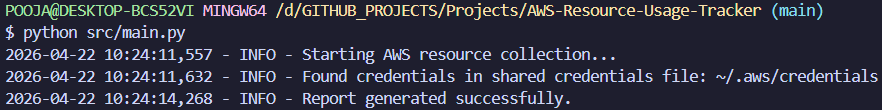
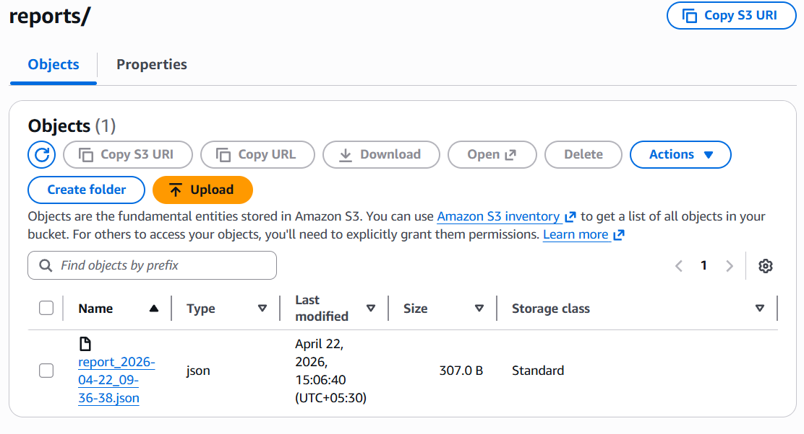
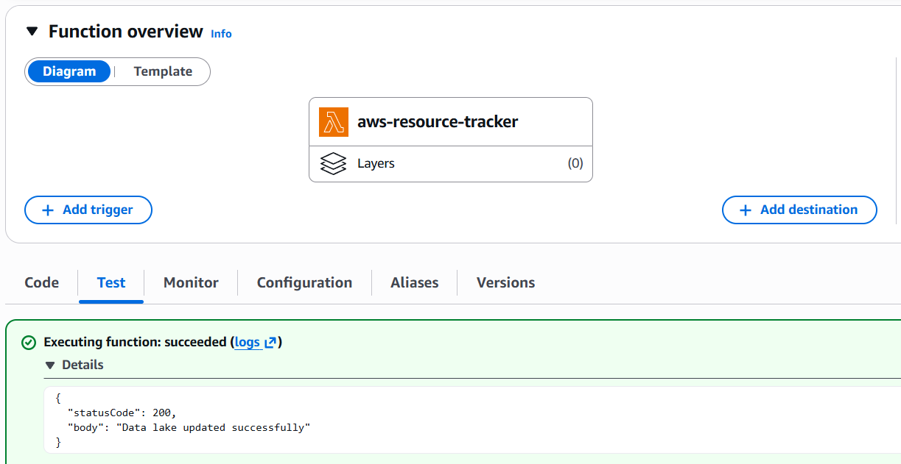
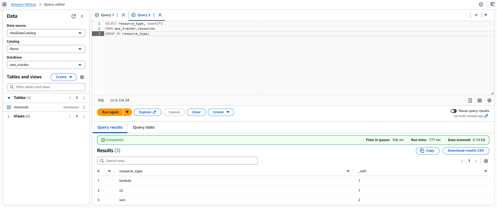
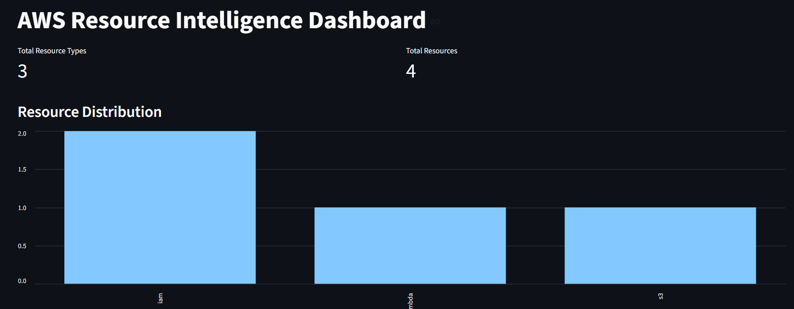
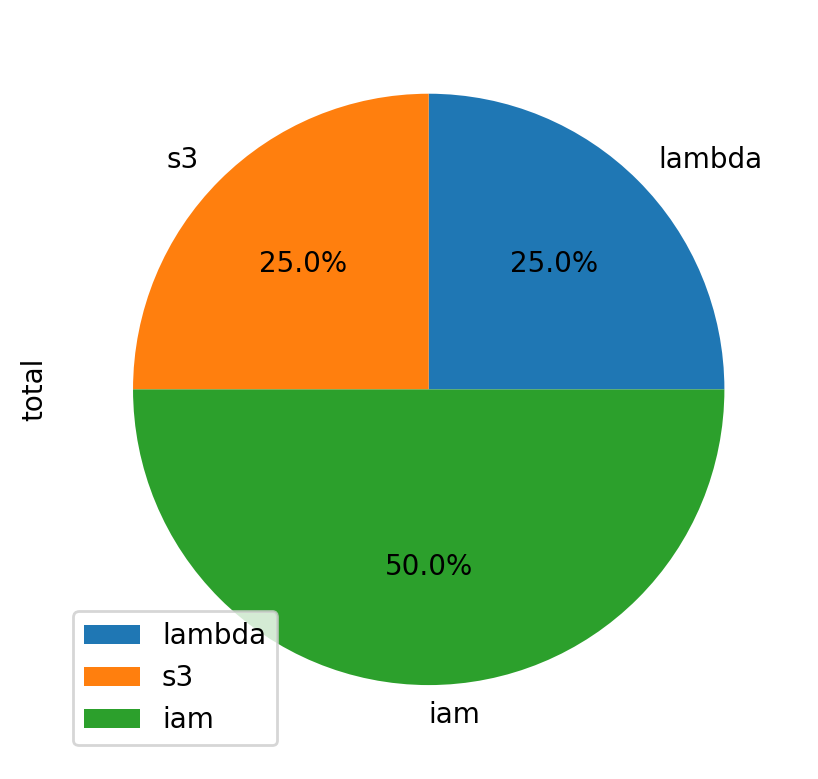
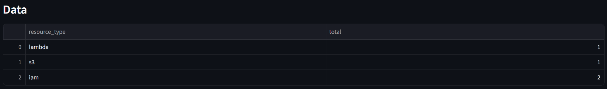

# ☁️ AWS Resource Intelligence Platform

## 🚀 Overview

Modern organizations often struggle with **cloud visibility, cost optimization, and resource governance**.

This project is a **cloud-native AWS resource intelligence platform** that automates the collection, storage, analysis, and visualization of AWS infrastructure data using a **serverless architecture**.

---

## 🎯 Key Features

* 🔄 Automated AWS resource tracking (EC2, S3, Lambda, IAM)
* ⚡ Serverless data pipeline using AWS Lambda & EventBridge
* 🪣 Data lake architecture using Amazon S3 (partitioned storage)
* 🔍 Query engine powered by Amazon Athena
* 📊 Interactive dashboard built with Streamlit
* 🧠 Structured data modeling for analytics
* 🔐 Secure IAM-based access (least privilege)

---

## 🏗️ Architecture

```
EventBridge (Scheduler)
        ↓
AWS Lambda (Python + Boto3)
        ↓
Amazon S3 (Data Lake - Bronze Layer)
        ↓
AWS Athena (Query Engine)
        ↓
Streamlit Dashboard (Visualization)
```

---

## ⚙️ Tech Stack

* **Cloud**: AWS (Lambda, S3, Athena, IAM, EventBridge)
* **Backend**: Python, Boto3
* **Data Engineering**: JSONL, Partitioned Data Lake
* **Visualization**: Streamlit, Plotly
* **Query Engine**: Athena (SQL)

---

## 📂 Project Structure

```
AWS-Resource-Usage-Tracker/
│
├── src/                    # Lambda + collectors
├── dashboard/             # Streamlit app
├── output/                # Local outputs (optional)
├── requirements.txt
└── README.md
```

---

## 🧠 How It Works

1. EventBridge triggers Lambda daily
2. Lambda collects AWS resource metadata using Boto3
3. Data is transformed into structured JSON (JSONL format)
4. Stored in S3 with partitioning (`date=YYYY-MM-DD`)
5. Athena queries data directly from S3
6. Streamlit dashboard visualizes insights

---

## 📊 Example Insights

* Resource distribution by type
* Running EC2 instances
* IAM user tracking
* Daily infrastructure trends

---

## ▶️ Running Dashboard Locally

```bash
pip install -r requirements.txt
python -m streamlit run dashboard/app.py
```

---

## 🔐 IAM Permissions

The system follows **least privilege principles**:

* ec2:DescribeInstances
* s3:ListAllMyBuckets
* s3:PutObject
* lambda:ListFunctions
* iam:ListUsers

---

## 💡 Future Enhancements

* 💰 Cost optimization using AWS Cost Explorer API
* 📉 Unused resource detection (idle EC2, orphaned volumes)
* 📊 Advanced dashboards (QuickSight / Grafana)
* 🔔 Alerts via SNS / Slack
* 🌍 Multi-account monitoring (AWS Organizations)

---

## Output















---