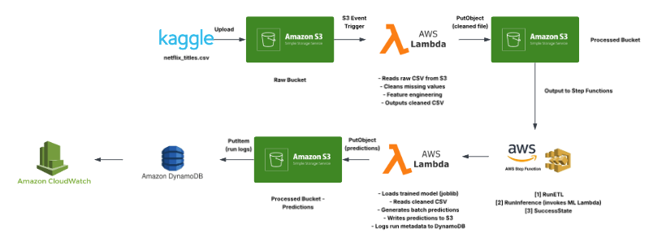
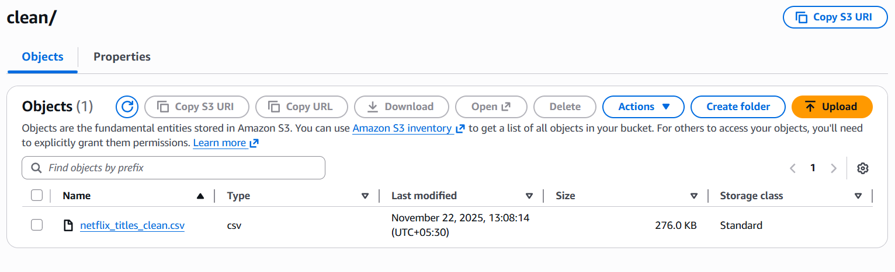
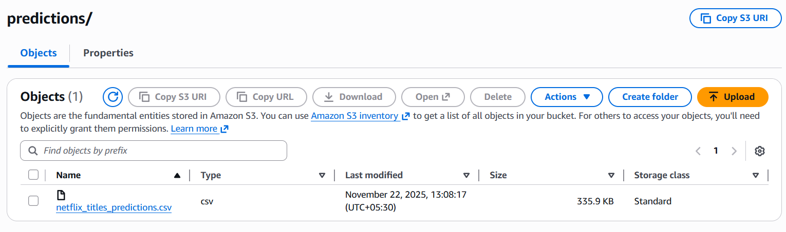
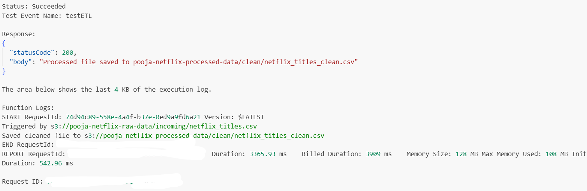
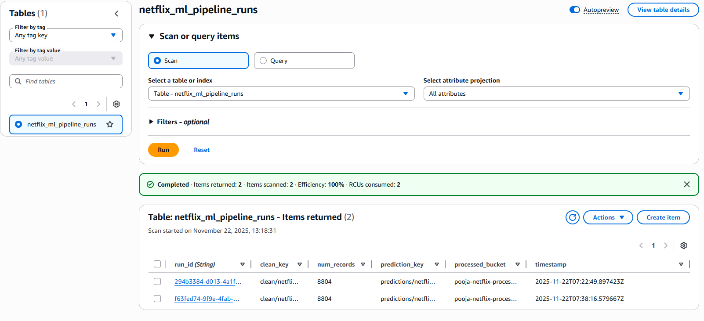
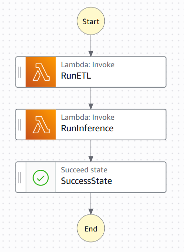
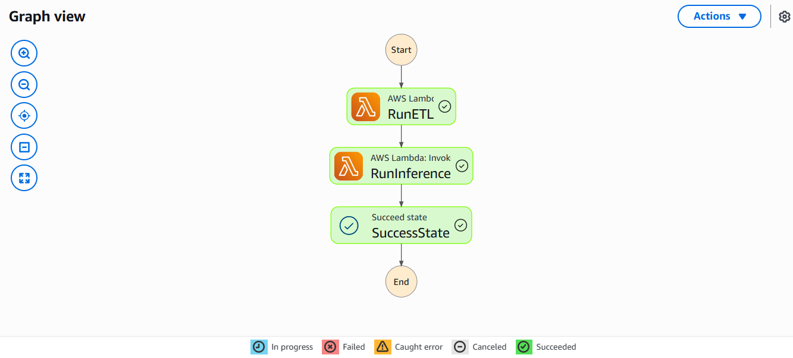

# 📘 **AWS Serverless Netflix ML Pipeline**

This project implements a **fully serverless, end-to-end machine learning pipeline** using **AWS Lambda, Step Functions, S3, DynamoDB**, and **CloudWatch**, powered by a Kaggle Netflix dataset.

It performs:

* **ETL & Feature Engineering**
* **Model Inference**
* **Orchestrated workflow (ETL → Inference)**
* **Predictions storage**
* **Pipeline run logging**

All without any servers — purely serverless + free-tier friendly.

---

# 📂 **Architecture Overview**

## 🧠 **High-Level Flow**

1. Raw CSV uploaded to **S3 → triggers ETL Lambda**
2. Lambda cleans data + engineering features → outputs processed CSV
3. **Step Functions** orchestrates:

   * RunETL
   * RunInference
   * Success
4. Inference Lambda:

   * loads ML model
   * runs predictions
   * saves output to S3
   * logs metadata to DynamoDB
5. CloudWatch logs all steps

---

# 🖼 **Architecture Diagram**




# 🚀 **Features**

### ✔ Fully Serverless

No EC2, no Kubernetes — all Lambda, S3, Step Functions.

### ✔ Automated ETL

Data cleaned + engineered automatically upon upload.

### ✔ Automated ML Inference

Batch predictions processed serverlessly.

### ✔ Logged Pipeline Metadata

DynamoDB stores:

* run_id
* timestamps
* clean file path
* predictions location
* record counts

### ✔ Production-ready Workflow

Step Functions coordinates the pipeline end-to-end.

---

# 🧰 **AWS Services Used**

| AWS Service        | Purpose                               |
| ------------------ | ------------------------------------- |
| **S3**             | Raw + Processed + Predictions storage |
| **Lambda**         | ETL, Model Inference                  |
| **Step Functions** | Orchestration                         |
| **DynamoDB**       | Pipeline run logging                  |
| **IAM**            | Access control                        |
| **CloudWatch**     | Logs + Monitoring                     |

---

# ⚙️ **Pipeline Steps Explained**

### 1️⃣ S3 Upload

User uploads:

```
incoming/netflix_titles.csv
```

### 2️⃣ ETL Lambda Triggered

Cleans data + feature engineering → saves:

```
clean/netflix_titles_clean.csv
```

### 3️⃣ Step Functions Runs

* RunETL
* RunInference
* SuccessState

### 4️⃣ ML Inference Lambda

* Loads model
* Predicts
* Saves:

```
predictions/netflix_titles_predictions.csv
```

### 5️⃣ DynamoDB Log

Stores metadata of each run.

---

# 💻 **Local Environment Setup**

Install dependencies:

```bash
pip install pandas scikit-learn boto3 joblib
```

Train model:

```bash
python model_training/train_model.py
```

# **Output**

**S3 Bucket**





**Lambda**





**DynamoDB**



**Step Functions - ELT Pipeline**




