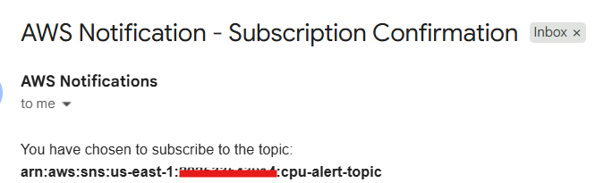
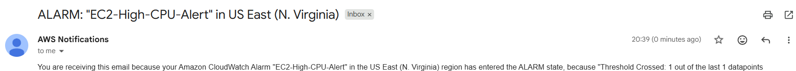
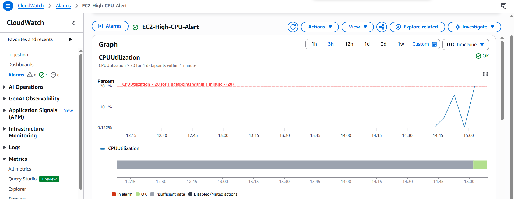

# **🚀 AWS CloudWatch Alert Automation with Self-Healing (Terraform + Lambda + SNS)**

## 🚀 Overview

This project demonstrates a **fully automated cloud monitoring and self-healing system** built using AWS services and Infrastructure as Code.

It detects high CPU utilization on EC2 instances and automatically triggers alerts and remediation actions.

---

## 🏗️ Architecture

**Flow:**

```
EC2 (CPU Spike Simulation)
        ↓
CloudWatch Metric (CPUUtilization)
        ↓
CloudWatch Alarm
        ↓
SNS Topic (Email Notification)
        ↓
Lambda Function (Auto-Recovery)
        ↓
EC2 Reboot (Self-Healing)
```

---

## ⚙️ Tech Stack

* AWS EC2
* AWS CloudWatch
* AWS SNS
* AWS Lambda
* Terraform (IaC)
* Python
* Docker
* GitHub Actions (CI)

---

## 🔥 Features

* ✅ Real-time CPU monitoring using CloudWatch
* ✅ Automated alerting via SNS (email notifications)
* ✅ Self-healing using Lambda (auto EC2 reboot)
* ✅ Infrastructure fully provisioned using Terraform
* ✅ CI pipeline with GitHub Actions
* ✅ Dockerized workload simulation

---

## 📂 Project Structure

```
Alert_Automation/
│
├── cpu_spike.py
├── Dockerfile
├── terraform/
│   ├── main.tf
│   ├── lambda_function.py
│   └── lambda_function.zip
├── .github/workflows/ci.yml
└── README.md
```

---

## ▶️ Setup Instructions

### 1️⃣ Clone Repo

```bash
git clone <repo-url>
cd Alert_Automation_Using_AWS_CloudWatch_+_SNS
```

---

### 2️⃣ Terraform Setup

```bash
cd terraform
terraform init
terraform apply
```

---

### 3️⃣ SSH into EC2

```bash
ssh -i terraform-key.pem ec2-user@<public-ip>
```

---

### 4️⃣ Run CPU Spike

```bash
python3 cpu_spike.py
```

---

### 5️⃣ Observe

* CloudWatch Alarm triggers
* Email received via SNS
* Lambda auto-restarts EC2

---

### 6️⃣ Cleanup 

```bash
terraform destroy
```

---

## 🔐 Security

* IAM roles with least privilege
* No hardcoded credentials
* Infrastructure managed via Terraform

---

## Output








---