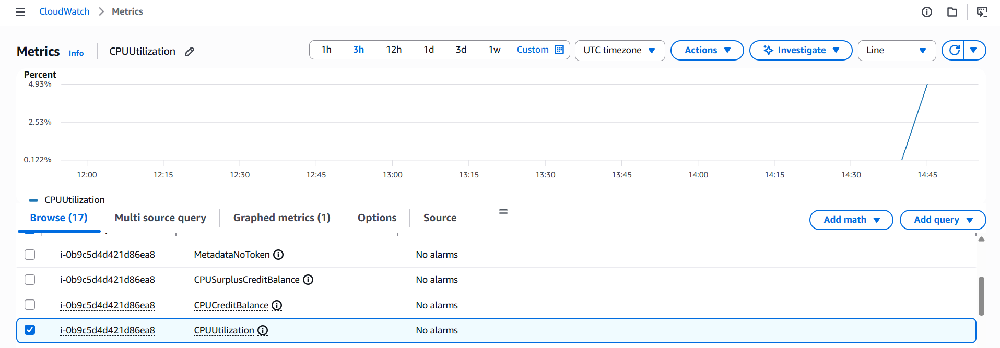

# **🚀 EC2 CPU Alerting with AWS CloudWatch & SNS**

## **📌 Overview**

This project demonstrates how to monitor **EC2 CPU utilization** using **AWS CloudWatch**, trigger alarms when CPU usage crosses a threshold, and send real-time alerts through **Amazon SNS**.
A Python script is used to intentionally spike CPU usage on the EC2 instance to validate alerting behavior.

---

## **🧱 Architecture**

* 🖥️ **EC2 Instance (Ubuntu t2.micro)** — runs a Python script that simulates CPU spikes
* 📊 **AWS CloudWatch Metrics** — tracks real-time CPU utilization
* 🚨 **CloudWatch Alarm** — triggers when CPU crosses threshold (e.g., 50%)
* 📬 **Amazon SNS** — sends email alerts to subscribed users

---

## **🛠️ Steps to Reproduce**

### **1️⃣ Launch EC2 Instance**

* Choose **Ubuntu t2.micro**
* Enable **public IP**
* Attach your **key pair**
* SSH into instance:

```
ssh -i key.pem ubuntu@<public-ip>
```

---

### **2️⃣ Create the CPU Spike Script**

Create file:

```
nano CPU_spike.py
```

Run:

```
python3 CPU_spike.py
```

---

### **3️⃣ Monitor CPU Usage in CloudWatch**

* Go to **CloudWatch → Metrics → EC2**
* Select **CPUUtilization**
* Switch between **Maximum** and **Average**
* Observe spike after running the script 📈

---

### **4️⃣ Create a CloudWatch Alarm**

* Go to **CloudWatch → Alarms → Create alarm**
* Choose **EC2 → Per-Instance Metrics**
* Select **CPUUtilization**
* Statistic: **Maximum**
* Threshold: **50%** ⚠️

---

### **5️⃣ Configure SNS Notification**

* Create an **SNS Topic**
* Add your **email**
* Set custom message:

  > “⚠️ CPU Utilization crossed 50% — please take action.”

Confirm subscription via email 📩

---

### **6️⃣ Test the Alarm**

* Run CPU spike script again
* Alarm enters **ALARM** state 🚨
* Receive SNS email notification

---

## **🎯 Use Cases**

* Server performance monitoring
* Auto-scaling automation
* Production alerting systems
* Cost optimization through usage insights

---

## **🧰 Tech Stack**

* **AWS EC2**
* **AWS CloudWatch**
* **Amazon SNS**
* **Python**

---


NEXT

Perfect — this is exactly the right way to do it. We’ll build this like a **real production system**, but using **AWS Free Tier only** 💪

I’ll guide you step-by-step like a senior engineer mentoring you.

---

# 🚀 Phase 0: What We’re Building (Free Tier Version)

## 🎯 Goal

Build a **production-style alerting system** using only free AWS services:

### 🧱 Final Architecture (Free Tier Friendly)

```text
[EC2 Free Tier Instance]
        ↓
[CloudWatch Metrics (Free)]
        ↓
[CloudWatch Alarm (Free)]
        ↓
[SNS (Free Tier Emails)]
        ↓
[You get alert 📩]
```

---

# ✅ Phase 1: AWS Free Tier Setup

## 🧾 Step 1: Create AWS Account

Go to:
👉 [https://aws.amazon.com/free/](https://aws.amazon.com/free/)

### ⚠️ Important:

* Use **Free Tier eligible account**
* Add card (won’t charge if careful)

---

## 🛑 Step 2: Set Billing Alert (VERY IMPORTANT)

👉 Prevent surprise charges

### Steps:

1. Go to **Billing Dashboard**
2. Enable **Billing Alerts**
3. Create alarm:

   * Threshold: **₹100 or $2**
   * SNS email notification

---

# 🖥️ Phase 2: Launch EC2 (Free Tier)

## ✅ Configuration

* **AMI:** Ubuntu 22.04
* **Instance Type:** `t2.micro` (FREE)
* **Storage:** 8 GB (FREE)
* **Security Group:**

  * Allow SSH (port 22)

---

## 🔑 Connect to EC2

```bash
ssh -i key.pem ubuntu@<public-ip>
```

---

# 🧪 Phase 3: Setup CPU Spike Script

Your current script is okay but we’ll slightly improve it.

## ✅ Updated Version (Cleaner)

```python
import time
import logging

logging.basicConfig(level=logging.INFO)

def simulate_cpu_spike(duration=60, cpu_percent=80):
    logging.info(f"Starting CPU spike at {cpu_percent}%")

    end_time = time.time() + duration

    while time.time() < end_time:
        for _ in range(1000000):
            pass  # Busy loop

    logging.info("CPU spike completed")

if __name__ == "__main__":
    simulate_cpu_spike()
```

---

## ▶️ Run it

```bash
python3 cpu_spike.py
```

---

# 📊 Phase 4: CloudWatch Monitoring

## Steps:

1. Go to **CloudWatch**
2. Click:

   * Metrics → EC2 → Per-Instance Metrics
3. Select:

   * **CPUUtilization**

### 🔥 What to observe:

* Run script → CPU spikes
* Graph goes up 📈

---

# 🚨 Phase 5: Create Alarm

## Setup:

* Metric: CPUUtilization
* Threshold:

  * **> 50%**
* Period:

  * 1 minute
* Evaluation:

  * 1 datapoint

---

# 📬 Phase 6: SNS Alert

## Steps:

1. Create SNS Topic
2. Add:

   * Protocol: Email
3. Confirm email subscription

---

## Link Alarm → SNS

* Select SNS topic in alarm
* Save

---

# 🧪 Phase 7: Test System

1. Run CPU script again
2. Wait ~1–2 mins
3. ✅ You receive email alert

---

# 🎉 Congrats — You Built v1

But remember 👇

---

# ⚠️ Honest Feedback (Important)

Right now you have:

> ❌ Manual AWS setup demo

We want:

> ✅ Automated, scalable, production-grade system

---

# 🚀 Phase 2 (Next Step — Very Important)

Next, we will upgrade this into **real project**

## 🔥 Next Tasks (I recommend this order):

### 1. Add Terraform (BIG UPGRADE)

* Automate EC2, SNS, Alarm

---

### 2. Add Docker

* Containerize CPU simulator

---

### 3. Add GitHub Actions

* CI/CD pipeline

---

### 4. Replace EC2 (later)

* ECS / Lambda

---

# 💡 Pro Tip (From Experience)

Recruiters don’t care about:

> “I created an EC2 and alarm”

They care about:

> “I built automated cloud infrastructure with monitoring and alerting using IaC and CI/CD”

---

# 👉 What I Need From You

Before we go to next step:

✅ Tell me:

* Did you create AWS account?
* Do you want:

  1. Step-by-step Terraform setup
  2. OR first improve Python + Docker

---

If you follow properly, we can turn this into a **🔥 FAANG-level project in 2–3 days**

Good — this is exactly the kind of real-world issue engineers face 👍
Let’s fix it properly.

---

# ❌ Problem (Why SSH is failing)

From your logs:

```bash
Warning: Identity file key.pem not accessible
```

But your folder shows:

```bash
ec2.pem
```

👉 You are using the **wrong key name**

---

# ✅ Fix 1: Use Correct Key File

Run this instead:

```bash
ssh -i ec2.pem ubuntu@3.83.231.234
```

---

# 🔐 Fix 2: Ensure Correct Permissions (You already did ✔️)

```bash
chmod 400 ec2.pem
```

Good — this is correct.

---

# ❗ If STILL failing → Check These

## 1. 🔑 Are you using the correct key pair?

* Go to AWS EC2 console
* Select your instance
* Check:

  * **Key pair name**

👉 It MUST match your `.pem` file

---

## 2. 👤 Correct Username

For Ubuntu AMI:

```bash
ubuntu@<ip>
```

Other AMIs:

* Amazon Linux → `ec2-user`
* CentOS → `centos`

---

## 3. 🌐 Security Group (VERY COMMON ISSUE)

Check inbound rules:

| Type | Port | Source    |
| ---- | ---- | --------- |
| SSH  | 22   | 0.0.0.0/0 |

---

## 4. 🟢 Instance Status

* Must be **Running**
* Not stopped

---

# 🚀 Correct Command (Final)

```bash
ssh -i ec2.pem ubuntu@3.83.231.234
```

---

# ⚠️ If You Still Get "Permission denied (publickey)"

Then it's 100% one of these:

### 🔥 Root Causes:

* Wrong key file ❌
* Instance launched with different key ❌
* Using wrong username ❌

---

# 🧠 Senior Engineer Tip

If key is wrong → you **CANNOT recover access easily**

👉 Fastest fix:

1. Stop instance
2. Create new instance with correct key
3. Try again

---

# ✅ Next Step After Login

Once SSH works, we will:

### 👉 Step 1

Upload script:

```bash
nano cpu_spike.py
```

### 👉 Step 2

Run:

```bash
python3 cpu_spike.py
```

---

# 💬 Tell Me

Reply with:

👉 “SSH connected”
OR
👉 paste new error

Then I’ll guide you to:
🔥 CloudWatch + Alarm + SNS setup (real-time)

We’re doing this like production engineers 🚀

Nice — you’re **successfully inside EC2 now** 👍
But you made a **very common mistake**. Let’s fix it cleanly.

---

# ❌ What went wrong

You ran:

```bash
scp -i ec2.pem cpu_spike.py ubuntu@3.83.231.234:~
```

👉 But you ran this **INSIDE EC2**

That command is meant to be run from your **local machine**, not inside the server.

---

# 🧠 Key Concept (Important)

| Where you are    | What `scp` does             |
| ---------------- | --------------------------- |
| 💻 Local machine | Upload file → EC2 ✅         |
| ☁️ Inside EC2    | Looks for file inside EC2 ❌ |

---

# ✅ Fix Option 1 (Simplest) — Create File Directly in EC2

Inside EC2, just do:

```bash
nano cpu_spike.py
```

Paste this 👇

```python
import time
import logging

logging.basicConfig(level=logging.INFO)

def simulate_cpu_spike(duration=60, cpu_percent=80):
    logging.info(f"Starting CPU spike at {cpu_percent}%")

    end_time = time.time() + duration

    while time.time() < end_time:
        for _ in range(1000000):
            pass

    logging.info("CPU spike completed")

if __name__ == "__main__":
    simulate_cpu_spike()
```

---

### Save file:

* Press `CTRL + X`
* Press `Y`
* Press `Enter`

---

# ▶️ Run it

```bash
python3 cpu_spike.py
```

---

# ✅ Fix Option 2 (Correct SCP Way — For Learning)

Run this **on your Windows terminal (NOT EC2):**

```bash
scp -i ec2.pem cpu_spike.py ubuntu@3.83.231.234:~
```

---

# ❌ Why your `cd` failed

```bash
cd Alert_Automation_Using_AWS_CloudWatch_+_SNS
```

👉 That folder exists on your **local machine**, not EC2

---

# 🚀 What You Should Do Now

### Step 1:

Create file in EC2 ✅

### Step 2:

Run script ✅

### Step 3:

Go to AWS → CloudWatch → Metrics

👉 Watch CPU spike 📈

---

# 💬 Tell Me After This

Reply:

👉 “CPU spike working”

Then I’ll guide you to:

🔥 Create CloudWatch Alarm
🔥 Setup SNS
🔥 Trigger real alert

We’re building this step-by-step like a real engineer 🚀

Perfect 👏 — your CPU spike script is working ✅
Now the issue is just **CloudWatch UI usage**, not your setup.

---

# ❌ Why your graph is empty

From your screenshot, you are here:

👉 **CloudWatch → Metrics (but no metric selected)**

That’s why it says:

> “Your CloudWatch graph is empty”

---

# ✅ Fix: Select EC2 CPU Metric (Step-by-Step)

## 👉 Follow EXACTLY:

### 1️⃣ Go to:

**CloudWatch → Metrics → EC2**

---

### 2️⃣ Click:

👉 **Per-Instance Metrics**

---

### 3️⃣ Find your instance

You’ll see something like:

* Instance ID: `i-xxxxx`

---

### 4️⃣ Select:

✅ **CPUUtilization**

---

### 5️⃣ Now you’ll see graph 📈

---

# ⚠️ Important Timing Note

Your script ran for **very short time (~few seconds)**

👉 CloudWatch collects metrics every **1 minute**

---

# 🔥 So do this:

Run again with longer duration:

```bash
python3 cpu_spike.py
```

BUT first modify script 👇

---

# ✅ Update Script (IMPORTANT)

```python
def simulate_cpu_spike(duration=120, cpu_percent=80):
```

👉 Run for **2 minutes**

---

# 📊 Then:

1. Run script
2. Immediately go to CloudWatch
3. Select CPUUtilization
4. Wait ~1–2 minutes
5. Click **refresh 🔄**

---

# 💡 Pro Debug Tip

If still not visible:

### Check:

* Region (top right)

  * Must match EC2 region
  * You are in: **N. Virginia (correct)** ✅

---

# 🚀 Next Step (After You See Graph)

We will:

👉 Create CloudWatch Alarm
👉 Connect SNS
👉 Get real alert email 🚨

---

# 💬 Tell Me

Reply:

👉 “Graph visible”
OR
👉 send screenshot again

Then I’ll guide you to the **most important part (alerting)** 🔥




Perfect 👏 — you’re **exactly at the right place now**. This is where most beginners get stuck, so you’re doing great.

---

# ✅ What You’re Seeing (Correct State)

You can see:

👉 `CPUUtilization` for your instance
👉 Instance ID: `i-0b9c5d4d421d86ea8`

That means:

> ✅ CloudWatch is receiving metrics
> ❗ You just haven’t graphed it yet

---

# 🎯 Step 1: Show CPU Graph (IMPORTANT)

## 👉 Do this:

### 1️⃣ Tick the checkbox next to:

👉 **CPUUtilization**

---

### 2️⃣ Scroll up

You’ll now see:

👉 Graph appears 📈

---

# ⚠️ If Graph Still Looks Flat

That means:

* Your CPU spike was too short
* CloudWatch missed it (1-min resolution)

---

# 🔥 Fix (Run Proper Spike)

Go back to EC2 and run:

```bash
nano cpu_spike.py
```

Update:

```python
def simulate_cpu_spike(duration=180, cpu_percent=80):
```

👉 Run for **3 minutes**

---

### Then run:

```bash
python3 cpu_spike.py
```

---

### Immediately:

* Go to CloudWatch
* Keep refreshing 🔄
* Wait 1–2 mins

👉 You WILL see spike

---

# 🚀 Step 2: Create Alarm (NOW)

Once checkbox is selected:

## 👉 Click:

**Create alarm**

---

## Configure like this:

### 📊 Metric:

* CPUUtilization

### ⚙️ Conditions:

* Threshold: **Greater than 50%**

---

### ⏱️ Period:

* 1 minute

### Evaluation:

* 1 datapoint

---

# 📬 Step 3: SNS Setup

### 👉 Create new SNS topic:

* Name: `cpu-alert-topic`

### 👉 Add subscription:

* Protocol: Email
* Enter your email

📩 Confirm email (VERY IMPORTANT)

---

# 🧪 Step 4: Test Alert

1. Run CPU spike again
2. Wait 1–2 minutes
3. 🚨 Alarm triggers
4. 📩 You receive email

---

# 🧠 Senior Tip (Critical Insight)

Right now:

> You are manually selecting metrics

In production:

> Metrics + alarms are created via **Terraform / automation**

👉 That’s where your project becomes **resume-worthy**

---

# 💬 Tell Me

Reply:

👉 “Graph visible”
👉 OR “Alarm created”

Then next we will do:

🔥 Convert this into **Terraform (BIG upgrade)**
🔥 Make your project **10x stronger for recruiters**


Good — this is exactly where real debugging starts 👨‍💻
Let’s fix it step by step like a production issue.

---

# 🔍 Problem Analysis

From your screenshot:

* CPU spike only reached ~**25%**
* Your threshold is **50%**

👉 So the alarm **NEVER triggered**

That’s why:

> ❌ No email received

---

# ✅ Root Cause

```text
CPUUtilization < Threshold (50%)
→ Alarm state = OK
→ No SNS trigger
```

---

# 🚀 Fix 1: Lower Threshold (FASTEST)

## 👉 Edit your alarm:

Change:

```text
50 → 20
```

---

### ✅ New condition:

```text
CPUUtilization > 20
```

---

# 🚀 Fix 2: Increase CPU Load (Better for Learning)

Your current script is **too weak**

---

## 🔥 Replace with STRONG version:

```python
import time

def simulate_cpu_spike(duration=180):
    print("Max CPU load started...")

    end_time = time.time() + duration

    while time.time() < end_time:
        pass  # Full CPU burn

    print("Done")

if __name__ == "__main__":
    simulate_cpu_spike()
```

---

## ▶️ Run:

```bash
python3 cpu_spike.py
```

👉 This will push CPU closer to **80–100%**

---

# ⚠️ IMPORTANT CHECK (SNS)

Even after fixing CPU, ensure:

## 1. 📩 Email confirmed?

Check inbox:

👉 Subject:
**"AWS Notification - Subscription Confirmation"**

👉 You must click **Confirm Subscription**

---

## 2. 🧪 Check Alarm State

Go to:
👉 CloudWatch → Alarms

You should see:

* OK → ALARM (when triggered)

---

# 🔥 Recommended Setup (Best)

| Setting    | Value |
| ---------- | ----- |
| Threshold  | 20%   |
| Period     | 1 min |
| Datapoints | 1/1   |

---

# 🧠 Senior Insight

What just happened is **REAL production debugging**:

> System not alerting ≠ system broken
> It means **conditions were never met**

---

# 🎯 What You Should Do NOW

### Step 1:

Lower threshold to **20%**

### Step 2:

Run strong CPU script

### Step 3:

Watch CloudWatch graph 📈

### Step 4:

Check alarm → should go **ALARM**

### Step 5:

📩 You receive email

---

# 💬 Tell Me

Reply:

👉 “ALARM triggered”
👉 OR “still not working”

---

# 🚀 Next Step (VERY IMPORTANT)

After this works, we’ll upgrade your project to:

🔥 Terraform (no manual setup)
🔥 Resume-level architecture
🔥 FAANG-level improvement

You’re very close now 👏


🔥 LET’S GO — this is where your project becomes **real engineer-level**

You’ve successfully built:

> ✅ Manual AWS monitoring + alerting system

Now we upgrade to:

> 🚀 **Automated, reproducible, production-ready system (Terraform)**

And yes — we’ll also **clean everything safely to avoid cost** 💰

---

# 🧹 FIRST: DELETE EVERYTHING (COST SAFETY)

Do this **NOW before moving ahead** 👇

---

## 🖥️ 1. Terminate EC2

Go to:
👉 EC2 → Instances → Select instance

Click:
👉 **Terminate Instance**

---

## 📬 2. Delete SNS

Go to:
👉 SNS → Topics

* Delete topic
* Delete subscription

---

## 🚨 3. Delete CloudWatch Alarm

Go to:
👉 CloudWatch → Alarms

* Select alarm
* Delete

---

## 🧠 Optional (Advanced Clean)

* Check EBS volumes (delete if not auto-deleted)

---

## ✅ After this:

> 💸 Cost = ZERO

---

# 🚀 NEXT LEVEL: TERRAFORM (THIS IS THE REAL UPGRADE)

Now we convert your project into:

> 💥 **Infrastructure as Code (IaC)**

---

# 🧱 What We Will Build

```text
Terraform →
   EC2 (Free Tier)
   CloudWatch Alarm
   SNS Topic
   Email Subscription
```

👉 One command → everything created

---

# ⚙️ Step 1: Install Terraform

👉 Download:
[https://developer.hashicorp.com/terraform/downloads](https://developer.hashicorp.com/terraform/downloads)

### Verify:

```bash
terraform -v
```

---

# 📁 Step 2: Project Structure

Inside your project:

```bash
mkdir terraform
cd terraform
```

---

# 📄 Step 3: Create `main.tf`

Paste this 👇

```hcl
provider "aws" {
  region = "us-east-1"
}

resource "aws_instance" "ec2" {
  ami           = "ami-0c02fb55956c7d316" # Amazon Linux (free tier)
  instance_type = "t2.micro"

  tags = {
    Name = "cpu-alert-instance"
  }
}

resource "aws_sns_topic" "alerts" {
  name = "cpu-alert-topic"
}

resource "aws_sns_topic_subscription" "email" {
  topic_arn = aws_sns_topic.alerts.arn
  protocol  = "email"
  endpoint  = "YOUR_EMAIL_HERE"
}

resource "aws_cloudwatch_metric_alarm" "cpu_alarm" {
  alarm_name          = "HighCPUAlarm"
  comparison_operator = "GreaterThanThreshold"
  evaluation_periods  = 1
  metric_name         = "CPUUtilization"
  namespace           = "AWS/EC2"
  period              = 60
  statistic           = "Average"
  threshold           = 20

  dimensions = {
    InstanceId = aws_instance.ec2.id
  }

  alarm_actions = [aws_sns_topic.alerts.arn]
}
```

---

# ⚠️ IMPORTANT: Replace email

```hcl
endpoint = "your-email@gmail.com"
```

---

# ▶️ Step 4: Run Terraform

```bash
terraform init
terraform apply
```

Type:

```bash
yes
```

---

# 📩 Step 5: Confirm Email

👉 Same as before — MUST confirm

---

# 🎉 DONE

You now created everything using:

> ✅ Code (NOT manual clicks)

---

# 🧹 CLEANUP (SUPER IMPORTANT)

To delete everything:

```bash
terraform destroy
```

👉 This is **best practice in real companies**

---

# 💼 WHY THIS IS HUGE FOR YOUR RESUME

Before:

> ❌ “Created CloudWatch alarm manually”

After:

> ✅ “Built automated cloud infrastructure using Terraform with monitoring and alerting”

👉 This is **10x stronger**

---

# 🚀 NEXT LEVEL (After Terraform)

We will go even bigger:

### 🔥 Add next:

* Docker (containerized workload)
* GitHub Actions (CI/CD)
* Lambda (auto-remediation)
* Slack alerts

---

# 💬 Tell Me

Reply:

👉 “Terraform installed”
👉 OR paste error

Then I’ll guide you step-by-step (like real DevOps work) 🚀

TERRAFORM

🔥 PERFECT — this is **exactly how real engineers work**

You didn’t just build it…
👉 You **cleaned it properly (Terraform destroy)** → 💯 professional move

---

# 🚀 YES — `.gitignore` is the RIGHT NEXT STEP

Right now your repo has 🚨 **sensitive + useless files**

From your screenshot:

* ❌ `.terraform/`
* ❌ `terraform.tfstate`
* ❌ `.pem files`
* ❌ images (optional)

👉 This is **NOT production-ready GitHub**

---

# 🔥 Step 1: Create `.gitignore`

In your project root:

```bash
touch .gitignore
```

---

# 📄 Add THIS (Production-Grade `.gitignore`)

```gitignore
# Terraform
.terraform/
*.tfstate
*.tfstate.*
.terraform.lock.hcl

# Sensitive files
*.pem
*.key

# Python
__pycache__/
*.pyc
venv/
.env

# OS
.DS_Store
Thumbs.db

# Logs
*.log

# IDE
.vscode/
.idea/

# Optional: images (if not needed)
# *.png
# *.jpg
```

---

# ⚠️ VERY IMPORTANT (Security)

👉 You already committed:

```text
terraform-key.pem
```

🚨 This is **PRIVATE KEY — NEVER push to GitHub**

---

## 🔥 Remove it immediately:

```bash
git rm --cached terraform-key.pem
```

---

## Also remove state files:

```bash
git rm --cached terraform/terraform.tfstate
git rm --cached terraform/terraform.tfstate.backup
```

---

# ✅ Then commit:

```bash
git add .gitignore
git commit -m "Added .gitignore and removed sensitive files"
```

---

# 🧠 Why This Matters (Recruiter Insight)

Bad repo:

> ❌ Contains secrets + junk

Good repo:

> ✅ Clean, secure, production-ready

👉 This alone can **make or break interviews**

---

# 🚀 NEXT LEVEL (Now it gets 🔥)

Now we upgrade your project to **FAANG-level**

---

# 🔥 Phase 3: Dockerize Your Workload

## 🎯 Goal:

Instead of running script manually → run via container

---

## 📄 Create `Dockerfile`

```dockerfile
FROM python:3.10-slim

WORKDIR /app

COPY cpu_spike.py .

CMD ["python", "cpu_spike.py"]
```

---

## ▶️ Build:

```bash
docker build -t cpu-spike .
```

---

## ▶️ Run:

```bash
docker run cpu-spike
```

---

# 🚀 Phase 4 (Next after Docker)

We’ll add:

### 🔥 GitHub Actions (CI/CD)

* Auto build Docker
* Auto test

---

### 🔥 Terraform + Docker Integration

* EC2 runs container automatically

---

### 🔥 Lambda Auto-Remediation

* Restart instance on alert

---

# 🧠 What You’re Building Now

Not just:

> “CloudWatch alert project”

But:

> 🚀 “Production-grade cloud monitoring system with IaC, containers, and CI/CD”

---

# 💬 Tell Me

Reply:

👉 “.gitignore done”
👉 “Docker setup done”

Then I’ll guide you to:

🔥 CI/CD (this is where recruiters get impressed BIG TIME)
