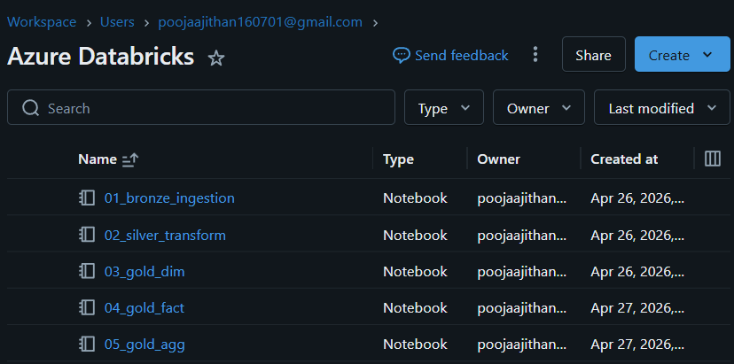
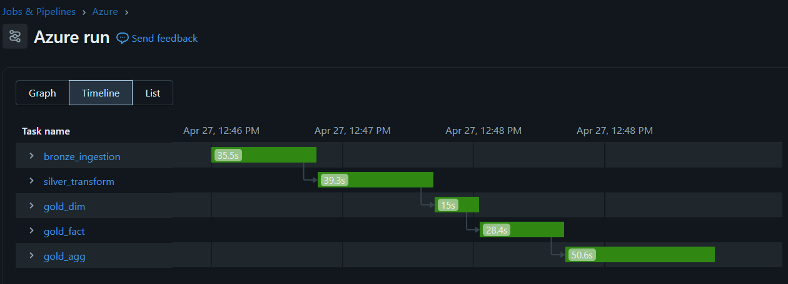
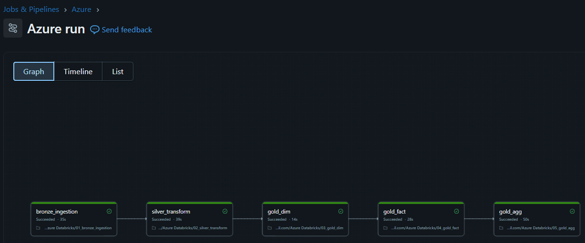
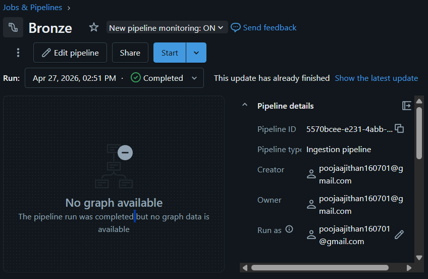
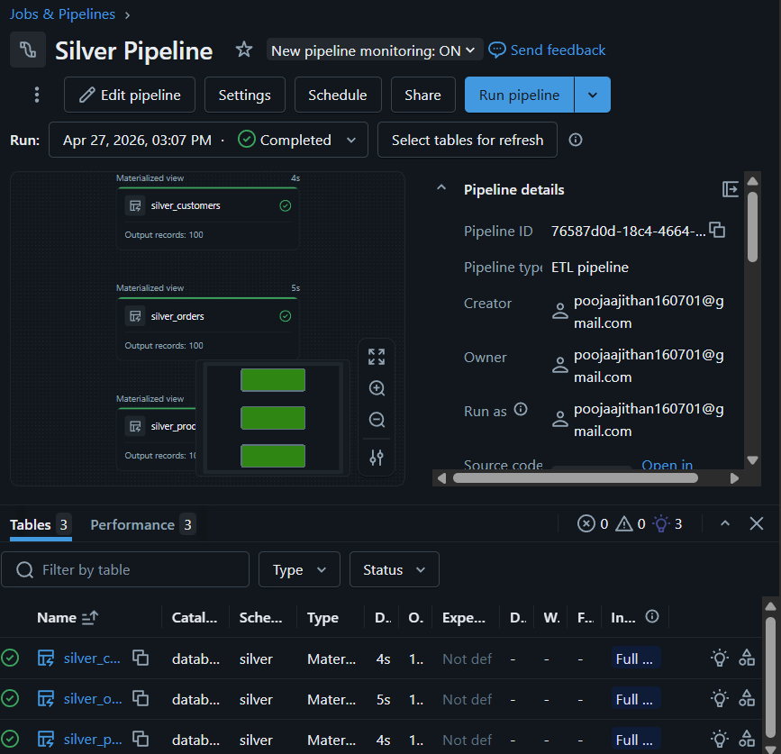
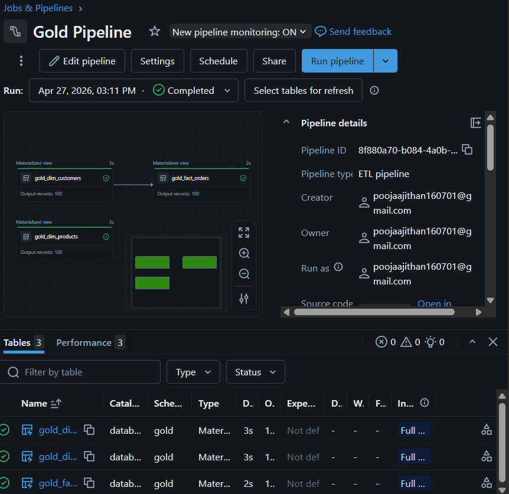
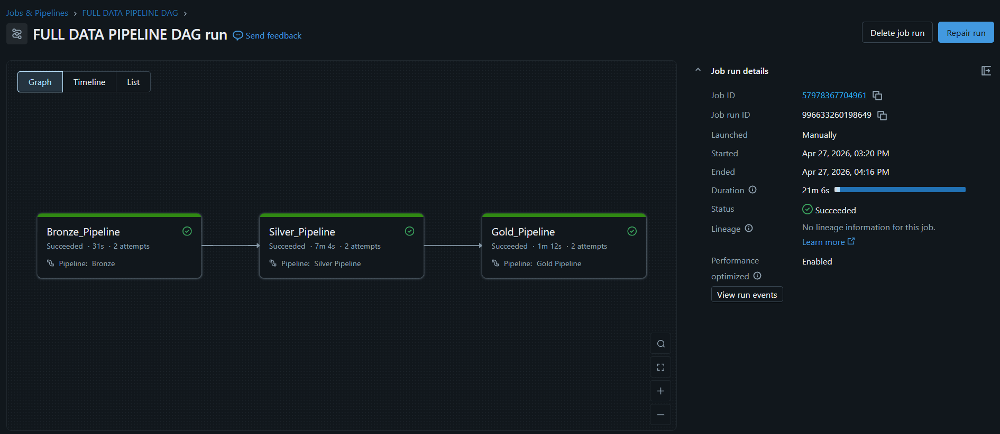

# 🚀 Azure Databricks End-to-End Data Engineering Project

## 📌 Overview

This project demonstrates a **production-style end-to-end data engineering pipeline** built using **Azure Databricks** and **Delta Lake**, following the **Medallion Architecture (Bronze → Silver → Gold)**.

The pipeline ingests raw data, transforms it into clean datasets, and models it into **analytics-ready tables** for business intelligence and reporting.

---

## 🧱 Architecture

```text
Raw Data (CSV)
     ↓
Bronze Layer (Ingestion)
     ↓
Silver Layer (Cleaning & Transformation)
     ↓
Gold Layer (Business Modeling - Star Schema)
     ↓
Analytics / BI / Reporting
```

---

## ⚙️ Tech Stack

* Azure Databricks (Serverless)
* PySpark
* Delta Lake
* Unity Catalog
* Databricks Jobs (Workflow Orchestration)
* SQL

---

## 🔄 Data Pipeline

### 🥉 Bronze Layer

* Ingest raw CSV data into Delta tables
* No transformation (raw storage)
* Acts as **source of truth**

---

### 🥈 Silver Layer

* Data cleaning & standardization
* Column transformations
* Derived fields:

  * `full_name`
  * `email_domain`
  * `order_value`
* Joins across datasets
* Data quality checks

---

### 🥇 Gold Layer (Business Layer)

#### ⭐ Data Modeling (Star Schema)

**Dimension Tables**

* `dim_customers` → SCD Type 1
* `dim_products` → SCD Type 2

**Fact Table**

* `fact_orders`

---

### ⚡ Advanced Features

* Incremental processing (Watermark logic)
* Delta MERGE (Upserts)
* Schema Evolution (`mergeSchema`)
* Partitioning (`order_year`)
* Z-Ordering (performance optimization)
* Aggregated tables for reporting
* Data quality validations

---

## 🔁 Pipeline Orchestration

* Built using **Databricks Jobs DAG**
* Automated workflow:

```text
Bronze → Silver → Gold → Aggregations
```

* Scheduled execution
* Dependency management

---

## 📂 Project Structure

```text
Azure-Databricks-End-to-End-Data-Engineering-Project/

├── notebooks/
│   ├── Databricks.ipynb
│
├── data/
│   ├── customers.csv
│   ├── orders.csv
│   ├── products.csv
│
├── images/
│
├── .gitignore
│
├── data_generator.py
│
├── README.md
```

---

## 📸 Screenshots
















---

## 🚀 How to Run

1. Upload CSV files to Databricks Volume / Storage
2. Run Bronze ingestion notebook
3. Run Silver transformation notebook
4. Run Gold layer notebooks (dim → fact → agg)
5. Execute full pipeline using Databricks Jobs

---

## 🔐 Security Note

Sensitive credentials are **not stored in code**.
Use:

* Databricks Secret Scopes
* Environment-based configuration

---

## 🎯 Key Outcomes

* Built a **scalable data pipeline using Spark**
* Implemented **real-world data modeling (Star Schema)**
* Enabled **analytics-ready datasets**
* Applied **industry best practices in data engineering**

---

## 💡 Future Improvements

* Power BI dashboard integration
* CI/CD pipeline (GitHub Actions)
* Infrastructure as Code (Terraform)
* Streaming pipeline (Kafka / Event Hub)

---