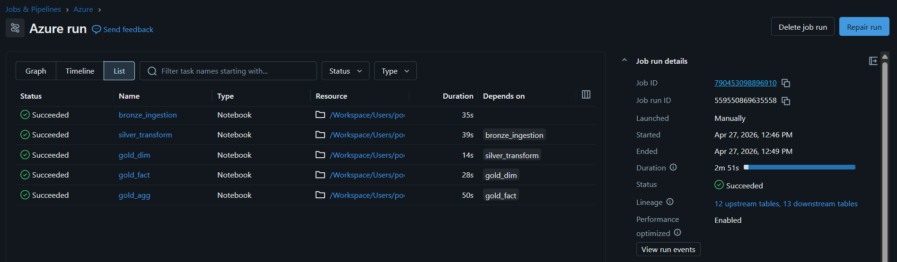

# 🚀 **Azure Databricks End-to-End Data Engineering Project**

### **Bronze → Silver → Gold Pipeline with Auto Loader, DLT, SCD Type-1 & Fact/Dim Modelling**

---

## 📌 **Project Overview**

This project demonstrates a complete **modern Lakehouse ETL architecture** using **Azure Databricks, ADLS Gen2, Delta Lake, Auto Loader, and Delta Live Tables (DLT)**.
It covers **dynamic ingestion**, **multi-layer Medallion architecture**, **surrogate key generation**, **SCD Type-1**, **Fact/Dim modelling**, **SQL & Python UDFs**, **window functions**, and **DLT expectations** for data quality.

This is a real-world project suitable for **production-scale retail/e-commerce ETL pipelines**.

---

## 🧩 **Architecture Summary**

```
                ┌──────────────────────────┐
                │   ADLS Gen2 – Source     │
                │ (orders, customers, ...) │
                └──────────────┬───────────┘
                               ▼
                 🔁 **Auto Loader (Streaming)**
                               ▼
                ┌──────────────────────────┐
                │      Bronze Layer        │
                │ (Raw → Parquet Streams)  │
                └──────────────┬───────────┘
                               ▼
                 🔧 **Silver Transformations**
                 - Cleaning / Dedup
                 - Parsing fields
                 - Window functions
                 - OOP class transformations
                               ▼
                ┌──────────────────────────┐
                │       Silver Layer       │
                └──────────────┬───────────┘
                               ▼
                ⭐ **Gold Layer (DLT + SCD)**
                 - DimCustomers (SCD1)
                 - DimProducts (SCD2 via DLT)
                 - FactOrders (Upsert)
                               ▼
                📊 **Gold Presentation Tables**
```

---

## 🏗️ **Technologies Used**

* **Azure Databricks**
* **Auto Loader (cloudFiles)**
* **Data Lake Storage Gen2 (ABFSS)**
* **Delta Lake (ACID tables)**
* **Delta Live Tables (DLT)**
* **PySpark (Structured Streaming + SQL API)**
* **Window Functions**
* **UDFs (SQL + Python-based UDF + Table-valued Functions)**
* **SCD Type-1 / Type-2**
* **Databricks Job Utilities (dbutils.jobs.taskValues)**

---

## 📁 **Repository Structure**

```
Databricks_Retail_ETL_Project/
│
├── Bronze_Layer.dbc
├── Silver_Customers.dbc
├── Silver_Orders.dbc
├── Silver_Products.dbc
├── Silver_Regions.dbc
├── Gold_Products_DLT.dbc
├── Gold_Customers_SCD1.dbc
├── Gold_Orders_Fact.dbc
├── parameters.dbc
└── README.md
```

---

# 🥉 **Bronze Layer – Auto Loader Dynamic Ingestion**

### ✔ Dynamic file ingestion using widget parameter

```python
dbutils.widgets.text("file_name","")
p_file_name = dbutils.widgets.get("file_name")
```

### ✔ Auto Loader streaming ingestion

```python
df = spark.readStream.format("cloudFiles")\
    .option("cloudFiles.format","parquet")\
    .option("cloudFiles.schemaLocation", f".../checkpoint_{p_file_name}")\
    .load(f".../source/{p_file_name}")
```

### ✔ Writing to Bronze Layer

```python
df.writeStream.format("parquet")\
    .option("path", f".../bronze/{p_file_name}")\
    .trigger(once=True)\
    .start()
```

---

# 🥈 **Silver Layer – Transformations**

## Silver Customers

* Extract domain from email
* Create full name
* Remove rescued data
* Write Delta table

```python
df = df.withColumn("domains", split(col('email'),'@')[1])
df = df.withColumn("full_name", concat(col('first_name'),lit(' '),col('last_name')))
```

---

## Silver Orders

Includes:

* Clean data
* Timestamp conversion
* Year extraction
* Window functions
* **OOP-based window transformations**

### OOP Class Example

```python
class windows:
    def dense_rank(self,df):
        return df.withColumn("flag",dense_rank().over(Window.partitionBy("year").orderBy(desc("total_amount"))))
```

---

## Silver Products

* SQL UDF
* Python UDF
* Table-valued UDF

### SQL Function

```sql
CREATE OR REPLACE FUNCTION discount_func(p_price DOUBLE)
RETURN p_price * 0.90
```

### Python Function

```sql
CREATE OR REPLACE FUNCTION upper_func(p_brand STRING)
LANGUAGE PYTHON AS $$ return p_brand.upper() $$
```

---

# 🥇 **Gold Layer – Fact & Dimensions**

## ⭐ **DimCustomers – SCD Type-1**

Steps:

1. Read Silver customers
2. Dedup using `dropDuplicates()`
3. Split old vs new records
4. Surrogate key generation
5. Merge using Delta Lake Upsert

### Surrogate Key Logic

```python
df_new = df_new.withColumn("DimCustomerKey", monotonically_increasing_id() + 1)
```

### Upsert into Delta Table

```python
dlt_obj.alias("trg").merge(df_final.alias("src"),
    "trg.DimCustomerKey = src.DimCustomerKey")\
    .whenMatchedUpdateAll()\
    .whenNotMatchedInsertAll()\
    .execute()
```

---

## ⭐ **DimProducts – SCD Type-2 with DLT**

### DLT Table with Expectations

```python
@dlt.expect_all_or_drop({"rule1": "product_id IS NOT NULL"})
```

### SCD2 Logic

```python
dlt.apply_changes(
  target = "DimProducts",
  source = "DimProducts_view",
  keys = ["product_id"],
  sequence_by = "product_id",
  stored_as_scd_type = 2
)
```

---

## ⭐ **FactOrders – Fact Table Upsert**

* Joins Silver orders with DimCustomers & DimProducts
* Creates fact record
* Uses Delta merge for Upsert

```python
dlt_obj.alias("trg").merge(df_fact_new.alias("src"),
   "trg.order_id = src.order_id AND trg.DimCustomerKey = src.DimCustomerKey")
```

---

# 🧪 Parameters Notebook

Passes dataset list dynamically using:

```python
dbutils.jobs.taskValues.set("output_datasets", datasets)
```

---

## 🎯 **Key Outcomes**

* Fully scalable **production-grade** ETL pipeline
* Implements **Lakehouse best practices**
* Automates ingestion → cleaning → modelling
* Uses **SCD Type-1, SCD Type-2, and Fact table upserts**
* Ensures **data quality with DLT expectations**


## Outputs





