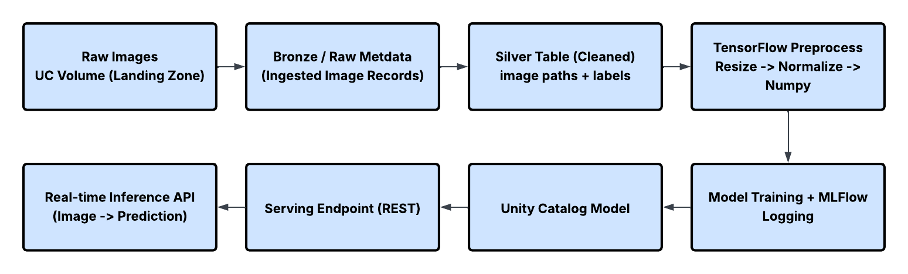
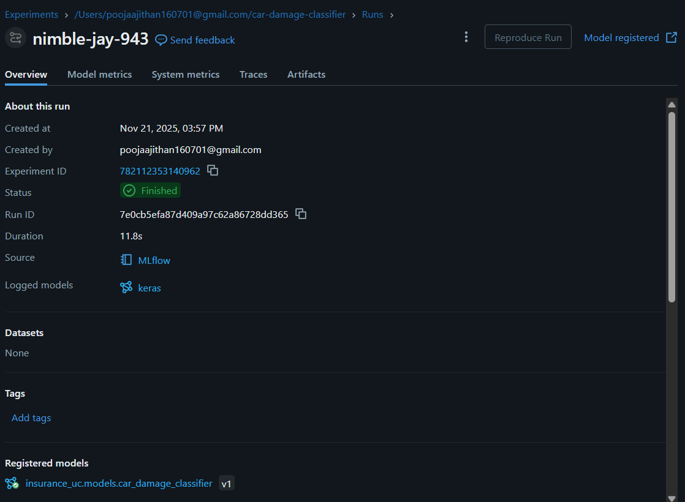

# 📘 **Car Damage Classification (Databricks End-to-End MLOps)**

## 🚀 Project Overview

This project implements a fully automated **end-to-end MLOps pipeline on Databricks** to classify car damage severity into:

* **minor**
* **moderate**
* **major**

It uses:

* **Databricks Volumes** (Unity Catalog storage)
* **Delta Tables (Bronze/Silver)**
* **TensorFlow (Keras)** for model training
* **MLflow** for experiment tracking
* **Unity Catalog Model Registry**
* **Databricks Model Serving endpoint** for real-time inference

---

## 🗂️ Project Structure

```
/Volumes/insurance_uc/landing/raw_data/data/training_imgs/     # raw car images
silver.training_images                                          # cleaned metadata table
car_damage_classifier                                           # saved .keras model
insurance_uc.models.car_damage_classifier                      # UC registered model
car_damage_model_ep                                             # serving endpoint
```

---

## 🛠️ Steps Completed End-to-End

### **1️⃣ Data Ingestion**

* Images ingested from Volumes path into Databricks.
* Invalid or unreadable files were automatically skipped.

### **2️⃣ Silver Table Creation**

* A **silver.training_images** table was created.
* Includes: image path, label, height, width.

### **3️⃣ Image Preprocessing**

* Loaded images with TensorFlow.
* Applied resizing to **224×224**.
* Converted to NumPy tensors for training.

### **4️⃣ Model Training**

* Built a Convolutional Neural Network (CNN) using TensorFlow.
* Trained on 56 valid images.
* Output layer: 3-class softmax.

### **5️⃣ MLflow Logging**

* Logged:

  * model artifact (.keras)
  * metrics
  * example input
  * model signature

### **6️⃣ Unity Catalog Model Registration**

* Registered MLflow run as a UC model:

  ```
  insurance_uc.models.car_damage_classifier
  ```
* Version 1 created.

### **7️⃣ Model Serving Deployment**

* Created endpoint:

  ```
  car_damage_model_ep
  ```
* Workload type: CPU
* Workload size: Small
* Scale-to-zero enabled
* Status: **READY**

### **8️⃣ Real-Time Inference**

* Loaded an image and predicted:

  ```
  Predicted class: major
  ```

---


# 🏗️ **Architecture Diagram**



---

# 🎯 Output

