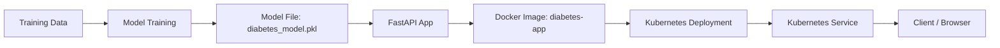
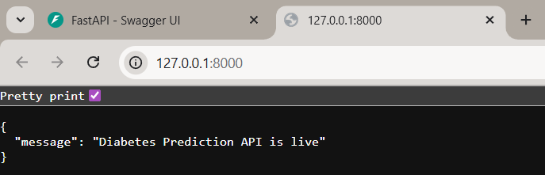
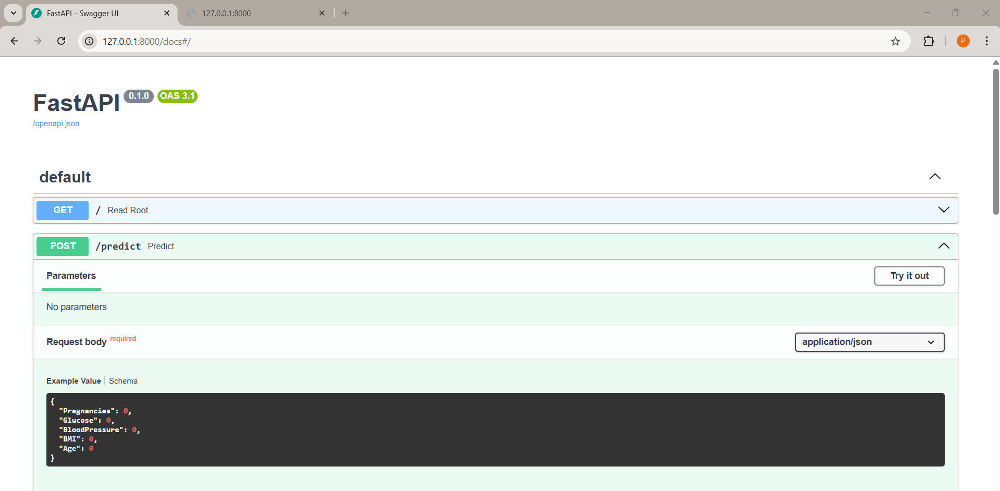
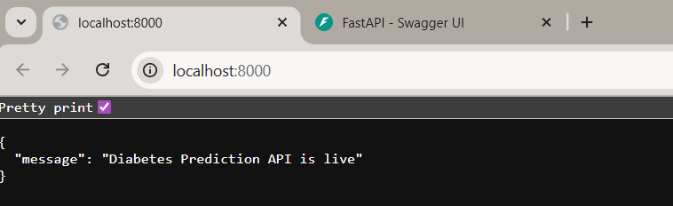
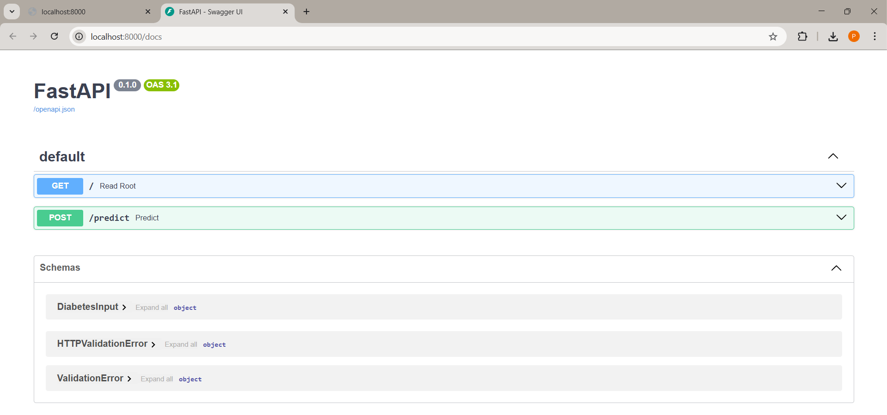

# 💉🩸 **Diabetes Prediction – End-to-End MLOps Project (FastAPI + Docker + Kubernetes)**

This project demonstrates a complete **machine learning deployment pipeline**, including:

* Model training
* API development with FastAPI
* Containerization with Docker
* Deployment on Kubernetes

The model predicts whether a person is diabetic based on basic health attributes.

---

## 🚀 **Tech Stack**

* **Python**
* **FastAPI**
* **Scikit-Learn**
* **Docker**
* **Kubernetes**
* **Uvicorn**
* **Joblib**

---

## 📌 **Project Features**

✔ Train a Random Forest model
✔ REST API for prediction
✔ Dockerized application
✔ Kubernetes deployment (Deployment + Service)
✔ Fully reproducible workflow

---

## 📊 **Dataset**

We use the **Pima Indians Diabetes Dataset**, loaded from:

```
https://raw.githubusercontent.com/plotly/datasets/master/diabetes.csv
```

Features used:

* Pregnancies
* Glucose
* BloodPressure
* BMI
* Age

Target:

* Outcome (0 = Non-diabetic, 1 = Diabetic)

---

# 🏗️ **Project Structure**

```
Diabetes-Prediction-MLops/
│── main.py                 # FastAPI application
│── train.py                # Model training script
│── requirements.txt        # Python dependencies
│── Dockerfile              # Docker container instructions
│── k8s-deploy.yml          # Kubernetes Deployment + Service
│── diabetes_model.pkl      # Saved ML model (generated after training)
│── README.md               # Project documentation
└── .gitignore
```

**Project Overview**



---

# ⚙️ **1. Install Dependencies**


```bash
pip install -r requirements.txt
```

---

# 🤖 **2. Train the Model**

```bash
python train.py
```

This generates:

```
diabetes_model.pkl
```

---

# 🌐 **3. Run FastAPI Locally**

```bash
uvicorn main:app --reload
```

Open:

👉 [http://127.0.0.1:8000](http://127.0.0.1:8000)
\
👉 [http://127.0.0.1:8000/docs](http://127.0.0.1:8000/docs)

---

# 🐳 **4. Docker Setup**

### Build the Docker image

```bash
docker build -t diabetes-app .
```

### Run the Docker container

```bash
docker run -p 8000:8000 diabetes-app
```

---

# ☸️ **5. Kubernetes Deployment**

### Apply Deployment + Service

```bash
kubectl apply -f k8s-deploy.yml
```

### Check pods

```bash
kubectl get pods
```

### Access the service

#### If using Docker Desktop:

```bash
kubectl port-forward svc/diabetes-service 8000:8000
```

Visit:

👉 [http://localhost:8000](http://localhost:8000)
\
👉 [http://localhost:8000/docs](http://localhost:8000/docs)

#### If using Minikube:

```bash
minikube service diabetes-service
```

---

# 🧪 **Sample Input (JSON)**

```json
{
  "Pregnancies": 2,
  "Glucose": 130,
  "BloodPressure": 70,
  "BMI": 28.5,
  "Age": 45
}
```

**Output - FastAPI Locally**





---

**Output - Docker**





---

# 🎯 **Future Improvements**

* Add CI/CD pipeline (GitHub Actions)
* Add monitoring + logging
* Deploy on AWS EKS / GCP / Azure
* Use MLflow for model tracking
---