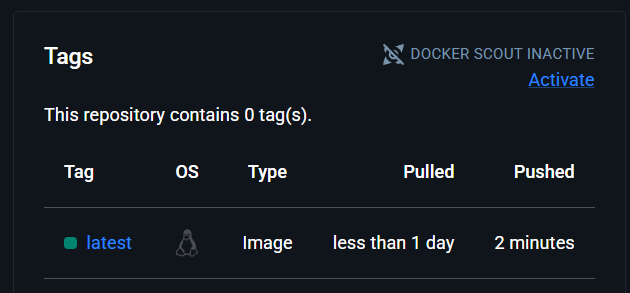
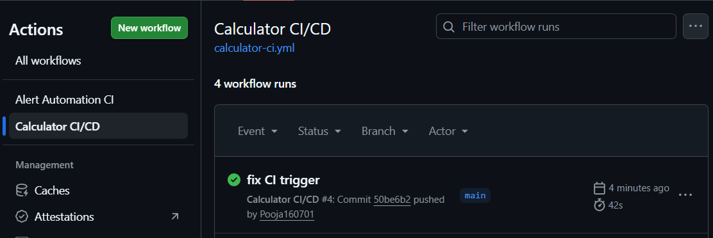

# 🚀 Distroless Calculator API (Production-Ready Microservice)

## 🔥 Overview

A **production-grade FastAPI microservice** demonstrating backend engineering, containerization, and end-to-end DevOps practices.
This project showcases **multi-stage Docker builds, distroless optimization, CI/CD automation, and real-world debugging of container runtime issues**.

---

## 🧠 Key Highlights

* ⚡ Built a **FastAPI-based REST API** with modular architecture
* 🐳 Optimized Docker images using **multi-stage builds & distroless/small base images**
* 📉 Reduced container size by **~50% (225MB → ~100MB)**
* 🔄 Implemented **end-to-end CI/CD pipeline using GitHub Actions**
* 🚀 Automated **DockerHub deployment on every push**
* 🧩 Applied **structured logging & centralized exception handling**
* 🛠️ Debugged complex issues (Python path, distroless runtime compatibility)

---

## 🏗️ Architecture

```text
Client → FastAPI → Service Layer → Response
           ↓
        Docker Container
           ↓
    GitHub Actions (CI/CD)
           ↓
       DockerHub
```

---

## ⚙️ Tech Stack

| Category         | Tools                                         |
| ---------------- | --------------------------------------------- |
| Backend          | FastAPI, Python                               |
| Containerization | Docker (Multi-stage, Distroless, Alpine/Slim) |
| CI/CD            | GitHub Actions                                |
| Testing          | Pytest                                        |
| Logging          | Python JSON Logger                            |
| Deployment       | DockerHub                                     |

---

## 📁 Project Structure

```
Docker/Multi-stage-distroless-calculator/
│
├── app/
│   ├── main.py
│   ├── routes/
│   ├── services/
│   ├── models/
│   └── utils/
│
├── tests/
├── Dockerfile
├── requirements.txt
└── .github/workflows/
```

---

## 🚀 API Usage

### Endpoint

```http
POST /calculate
```

### Request

```json
{
  "operation": "add",
  "a": 10,
  "b": 5
}
```

### Response

```json
{
  "operation": "add",
  "a": 10,
  "b": 5,
  "result": 15
}
```

---

## 🐳 Run with Docker

```bash
docker pull pooja160701/calculator-api:latest
docker run -p 8000:8000 pooja160701/calculator-api:latest
```

👉 Open: http://localhost:8000/docs

---

## 🔄 CI/CD Pipeline

Automated pipeline using **GitHub Actions**:

* ✅ Install dependencies
* ✅ Run unit tests (Pytest)
* ✅ Build Docker image
* ✅ Push to DockerHub

---

## 📊 Image Optimization

| Version   | Size   |
| --------- | ------ |
| Initial   | ~225MB |
| Optimized | ~106MB |

---

## 🔐 Security & Best Practices

* Distroless / minimal base images
* No unnecessary dependencies
* Environment isolation
* Secrets managed via GitHub Actions
* Non-root container execution

---

## 🧪 Testing

```bash
pytest tests/
```

---

## 🚀 Future Enhancements

* Kubernetes deployment (Minikube / EKS)
* Prometheus + Grafana monitoring
* Rate limiting & authentication
* Load testing

---

## Output






---