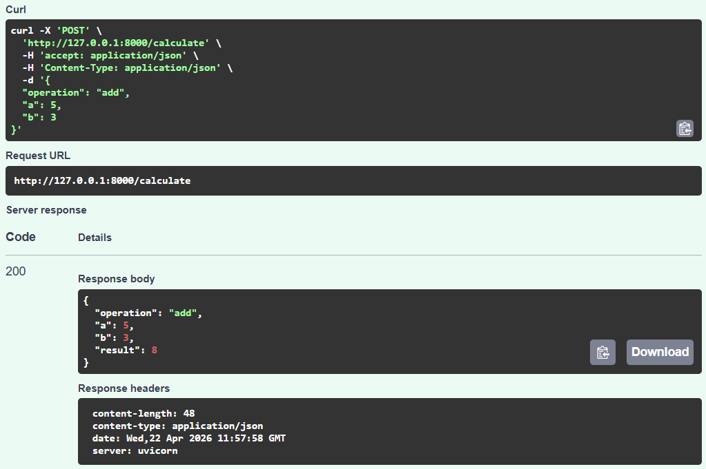
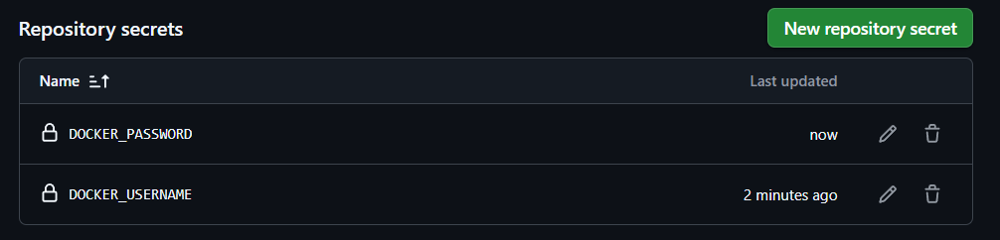

# 🔢 **Distroless Multi‑Stage Calculator (Go)**

---

## Project Overview

A tiny command‑line calculator written in Go that demonstrates modern Docker best practices: multi‑stage builds and distroless/scratch final images to produce ultra‑small, secure container images. The repo contains a minimal Go CLI, a Dockerfile using a build stage on an Ubuntu (or golang) image, and a final `scratch` stage that copies only the static binary.

---

## What you get in this project

* `main.go` — Minimal Go CLI calculator (add, sub, mul, div) with a help flag.
* `Dockerfile` — Multi‑stage build: build in `ubuntu` (or `golang`), produce a static binary, copy to `scratch` final image.
* `.dockerignore` — Keeps the context small when building images.
* `README.md` — (this file) explanation + commands.

---

## Why multi‑stage + distroless?

* **Smaller final image**: build tools, package managers, intermediate caches are not included in the final image.
* **Better security**: fewer packages means smaller attack surface.
* **Faster distribution**: smaller image = faster push/pull and faster CI jobs.

This project uses a build stage to compile a static Go binary and then copies the artifact into a minimal `scratch` image. The final image contains only the binary and nothing else.

---

## File: Dockerfile

> Note: In the example above `ubuntu` is used in the build stage for demonstration; for faster builds you may use `golang:1.20-bullseye` or `golang:alpine`. The `scratch` final stage gives the smallest possible image.

---

## Build & run steps (local)

### Build the image

```bash
# From project root (where Dockerfile is)
docker build -t distroless-calculator .
```

### Run the container

```bash
# run an add operation
docker run --rm distroless-calculator: add 3 5
# output: 8
```

---

## Quick size comparison (what to expect)

* Single‑stage image using Ubuntu base: **~800MB+** (includes apt cache, compilers, libs)
* Using `golang` build stage + `scratch` final stage: **~2MB–10MB** (depending on binary and included CA certs)

---

## Output



