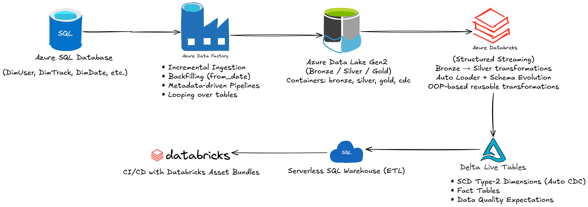

# 🎧 **Spotify Azure Data Engineering End-to-End Project (With CI/CD)**

## 📌 **Project Overview**

This project is a **complete, production-ready Azure Data Engineering Platform** built using the Spotify dataset.
It implements a **Medallion Architecture (Bronze → Silver → Gold)** and includes:

✔ **Incremental ingestion** (CDC-based)  
✔ **Backfill capability**  
✔ **Structured Streaming with Auto Loader**  
✔ **SCD Type-2 using Delta Live Tables (DLT)**  
✔ **Metadata-driven pipeline design**  
✔ **Dynamic SQL generation with Jinja**  
✔ **Star Schema modeling**   
✔ **Unity Catalog governance**   
✔ **CI/CD deployment with Databricks Asset Bundles**

This project replicates how modern enterprise data teams build **real-time, reliable, scalable pipelines**.

---

# 🏗️ **Architecture Diagram**



---

# 🧰 **Tech Stack**

### **Azure Services**

* Azure SQL Database
* Azure Data Factory
* Azure Data Lake Gen2 (ADLS)
* Azure Databricks
* Unity Catalog
* Logic Apps (Pipeline Failure Alerts)

### **Databricks Technologies**

* Delta Lake
* Auto Loader
* Structured Streaming
* Delta Live Tables
* Unity Catalog
* Databricks Asset Bundles (CI/CD)
* Serverless SQL Warehouse

### **Programming / Tools**

* PySpark
* SQL
* Jinja2 templating
* Python OOP (Reusable utilities)
* GitHub (Version Control)

---

# 🥉 **Bronze Layer: Ingestion Using Azure Data Factory**

## ✅ Features Implemented

✔ **Incremental Load** (CDC-based using updated_at)  
✔ **Initial Load + Incremental in one pipeline**   
✔ **Backfill logic (from_date parameter)**   
✔ **Watermarking using JSON file**   
✔ **Avoiding empty file creation**   
✔ **Dynamic file naming**  
✔ **Metadata-driven design (loop over all tables)**

### ✔ CDC JSON Structure

```
/bronze/DimUser_CDC/
   ├─ empty.json
   ├─ cdc.json   { "last_cdc": "2025-01-01" }
```

### ✔ Looping Pipeline Input

```json
[
  { "schema": "dbo", "table": "DimUser", "cdc_col": "updated_at", "from_date": "" },
  { "schema": "dbo", "table": "DimTrack", "cdc_col": "updated_at", "from_date": "" },
  { "schema": "dbo", "table": "DimDate", "cdc_col": "date",        "from_date": "" },
  { "schema": "dbo", "table": "DimArtist", "cdc_col": "updated_at","from_date": "" },
  { "schema": "dbo", "table": "FactStream","cdc_col": "stream_timestamp","from_date": "" }
]
```

---

# 🥈 **Silver Layer: Databricks Streaming Using Auto Loader**

### **Key Concepts**

✔ Bronze → Silver using **cloudFiles Auto Loader**   
✔ **Schema Evolution** (add new columns)   
✔ **Rescued Data column handling**   
✔ **Reusable transformation utilities**      
✔ **Deduplication**    
✔ **Delta Tables** creation using `toTable()`

---

## **Example: Silver DimUser**

### 📥 Streaming Read

```python
df = spark.readStream.format("cloudFiles") \
    .option("cloudFiles.format", "parquet") \
    .option("cloudFiles.schemaLocation", "abfss://silver/.../DimUser/checkpoint") \
    .load("abfss://bronze/.../DimUser")
```

### 🔧 Reusable Transformation Class

```python
class reusable:
    def dropColumns(self, df, columns):
        return df.drop(*columns)
```

### ✨ Transformations

* Convert username → UPPERCASE
* Drop rescued data
* Deduplicate on `user_id`

### 💾 Write to Delta + Register as Table

```python
df.writeStream.format("delta") \
    .outputMode("append") \
    .option("checkpointLocation", "abfss://silver/.../checkpoint") \
    .trigger(once=True) \
    .toTable("spotify_cata.silver.DimUser")
```

---

# 🥇 **Gold Layer: Delta Live Tables (DLT)**

## ✔ SCD Type-2 (Auto CDC Flow)

Implemented for:

* DimUser
* DimTrack
* DimArtist
* DimDate
* FactStream

### Example (DimUser)

```python
import dlt

@dlt.table
def dimuser_stg():
    return spark.readStream.table("spotify_cata.silver.dimuser")

dlt.create_streaming_table("dimuser")

dlt.create_auto_cdc_flow(
    target="dimuser",
    source="dimuser_stg",
    keys=["user_id"],
    sequence_by="updated_at",
    stored_as_scd_type=2
)
```

---

# ✔ **Delta Live Tables: Expectations (Data Quality)**

### Example Rules

```python
expectations = {
    "rule1": "user_id IS NOT NULL",
    "rule2": "updated_at IS NOT NULL"
}
```

### Apply Expectations

```python
dlt.create_streaming_table(
    name="dimuser",
    expect_all_or_drop=expectations
)
```

---

# ⭐ **Metadata-Driven SQL Using Jinja**

### Parameters

```python
parameters = [
  {"table": "spotify_cata.silver.factstream", "alias": "f", "cols": "f.stream_id, f.listen_duration"},
  {"table": "spotify_cata.silver.dimuser", "alias": "u", "cols": "u.user_id, u.user_name", "condition": "f.user_id = u.user_id"}
]
```

### Template

```python
from jinja2 import Template
query = Template(query_text).render(parameters=parameters)
```

Generates fully dynamic SQL queries for star-schema joins.

---

# 🚀 **CI/CD With Databricks Asset Bundles**

### YAML: `databricks.yml`

```yaml
bundle:
  name: spotify_dab

targets:
  dev:
    mode: development
    default: true
    workspace:
      host: https://...
  prod:
    mode: production
    workspace:
      host: https://...
```

### Commands

```bash
databricks bundle validate
databricks bundle summary
databricks bundle deploy --target dev
```

This enables **repeatable deployments** of notebooks, jobs, DLT pipelines across environments.

---

# 📊 **Star Schema Model**

### **Dimensions**

* DimUser
* DimArtist
* DimTrack
* DimDate

### **Fact Table**

* FactStream (listening activity)

---

# 📁 **Project Folder Structure**

```
Spotify-Data-Engineering-Project/
│
├── source_scripts/
│   ├── spotify_initial_load.sql
│
├── spotify_dab/
│   ├── .databricks
│   │   └── bundle
│   │       └── dev
│   │       └── prod
│   ├── .vscode
│   ├── Jinja
│   │   └── jinja_notebook.py
│   ├── resources
│   ├── src
│   │   └── gold
│   │       └── dlt
│   │           └── explorations
│   │               └── sample_exploration.py
│   │           └── transformations
│   │           └── utilities
│   │   └── silver
│   │       └── silver_Dimensions.py
│   ├── utils
├── cdc.json
├── empty.json
├── loop_input
└── README.md
```

---

# 🏁 **Final Output**

By the end of the project:

✔ All Bronze → Silver → Gold tables created    
✔ Auto Loader streaming ingestion running    
✔ Delta Live Tables running with SCD Type-2      
✔ Metadata-driven joins working with Jinja   
✔ CI/CD ready for dev → prod deployment    
✔ Full Medallion Lakehouse architecture completed

---