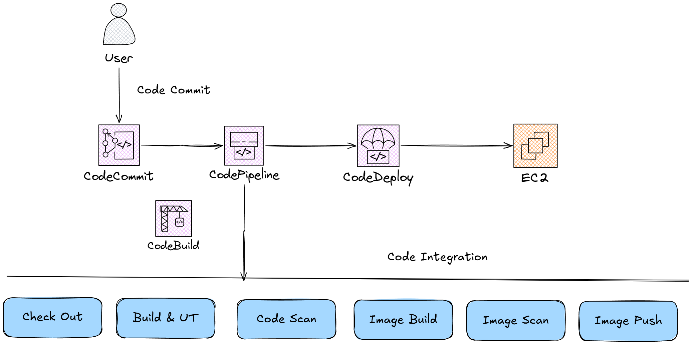
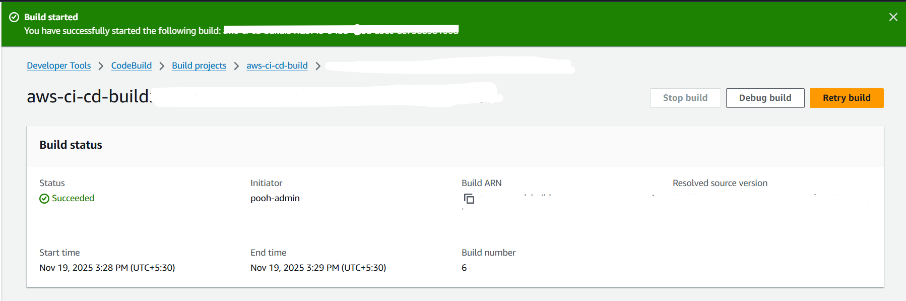

# 🚀 AWS CI/CD Pipeline for Python Flask App

*A Fully Automated CI/CD Pipeline Using GitHub → CodeBuild → CodeDeploy → EC2*

---

## 📌 **Project Overview**

This project demonstrates a **complete end-to-end CI/CD pipeline** using AWS services to build, package, and deploy a Python Flask application inside Docker on an EC2 instance.

This pipeline automates:

1. **Source control** (GitHub)
2. **Continuous Integration (CI)** with AWS CodeBuild
3. **Artifact packaging** inside Docker
4. **Continuous Delivery (CD)** with AWS CodeDeploy
5. **Automatic deployment** to an EC2 instance
6. **App served using Docker container on EC2**

This project is ideal for learning **AWS DevOps, CI/CD, CodeBuild, CodeDeploy, EC2, Docker, and automation pipelines**.

---

# 📁 **Project Structure**

```
aws-ci-cd-python-app/
 └── python-app/
      ├── app.py
      ├── Dockerfile
      ├── requirements.txt
      ├── buildspec.yml
      ├── appspec.yml
      ├── start_container.sh
      └── stop_container.sh
```

---

# 📸 Architecture Diagram (Conceptual)




# 🛠 AWS Services Used

| Service                   | Purpose                                      |
| ------------------------- | -------------------------------------------- |
| **EC2**                   | Hosts final Flask application (Docker)       |
| **CodeBuild**             | Builds Docker image, installs dependencies   |
| **CodeDeploy**            | Deploys artifact & executes scripts          |
| **IAM**                   | Service roles for CodeBuild, CodeDeploy, EC2 |
| **SSM Parameter Store**   | Stores encrypted Docker registry credentials |
| **VPC + Security Groups** | Network access                               |
| **GitHub**                | Source code repository                       |

---

# 🐍 Application Overview

### `app.py`

A simple Flask web app that returns:

```python
from flask import Flask
app = Flask(__name__)

@app.route("/")
def home():
    return "Hello from AWS CI/CD Pipeline!"
```

---

# 🐳 Docker Setup

### **Dockerfile**

Packages the Flask app into a container.

### **start_container.sh / stop_container.sh**

Controls container lifecycle during CodeDeploy deployment.

---

# 🔧 CodeBuild Configuration (CI)

### `buildspec.yml` (key operations)

✔ Loads Docker Hub credentials from SSM
✔ Installs Python dependencies
✔ Builds Docker image
✔ Pushes Docker image to Docker Hub

---

# 🚚 CodeDeploy Configuration (CD)

### `appspec.yml` (key operations)

✔ Pulls latest Docker image
✔ Stops old container
✔ Starts new container

---

# 🖥️ Deployment Flow

### **1️⃣ Git push → GitHub**

Triggers webhook → CodeBuild starts.

### **2️⃣ CodeBuild**

* Installs Python
* Installs dependencies
* Builds Docker image
* Pushes image to DockerHub

### **3️⃣ CodeDeploy**

* Connects to EC2
* Stops old container
* Deploys new version

### **4️⃣ EC2**

Runs the Flask app via Docker.

---

# 🚀 How to Deploy App (Full Steps)

## **1. Launch EC2**

Ubuntu 24
t3.micro
Allow inbound: `80`, `22`

Install dependencies:

```bash
sudo apt update -y
sudo apt install docker.io ruby-full wget -y
sudo systemctl start docker
sudo systemctl enable docker
```

Install CodeDeploy Agent:

```bash
cd /home/ubuntu
wget https://aws-codedeploy-us-east-1.s3.amazonaws.com/latest/install
sudo chmod +x ./install
sudo ./install auto
sudo systemctl status codedeploy-agent
```

---

## **2. Create IAM Roles**

### **Role 1: CodeBuild role**

Attach:

```
AmazonS3FullAccess
AmazonEC2ContainerRegistryFullAccess
AmazonSSMReadOnlyAccess
```

### **Role 2: CodeDeploy role**

Attach:

```
AWSCodeDeployRole
```

### **Role 3: EC2 Instance Role**

Attach:

```
AmazonSSMManagedInstanceCore
AWSCodeDeployRole
```

---

## **3. Create CodeBuild Project**

* Connect GitHub account
* Use **buildspec.yml**
* Use SSM environment variables

---

## **4. Create CodeDeploy Application + Deployment Group**

* EC2/On-premises
* Use EC2Tag: Name = python-app-server
* Service role = CodeDeploy role

---

## **5. Trigger Deployment**

Push changes:

```
git add .
git commit -m "Test deployment"
git push
```

Build starts → deploys automatically.

---

# ✔ Verification

Visit your EC2 public IP:

```
http://<EC2_PUBLIC_IP>
```

You will see:

**Hello from AWS CI/CD Pipeline!**

---

# 🧹 Cleanup (Avoid Charges)

To delete everything:

### Delete EC2

```
Instance
Security groups
Key pair
```

### Delete CodeDeploy

Application → deployment groups.

### Delete CodeBuild

Projects + S3 bucket artifacts.

### Delete IAM roles:

* CodeBuild role
* CodeDeploy role
* EC2 role

### Delete SSM Parameters

```
/myapp/docker-credentials/*
/myapp/docker-registry/url
```


---