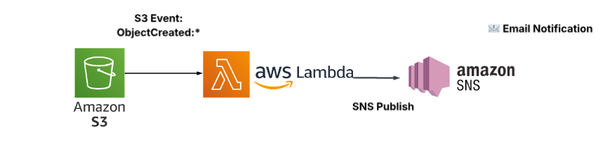
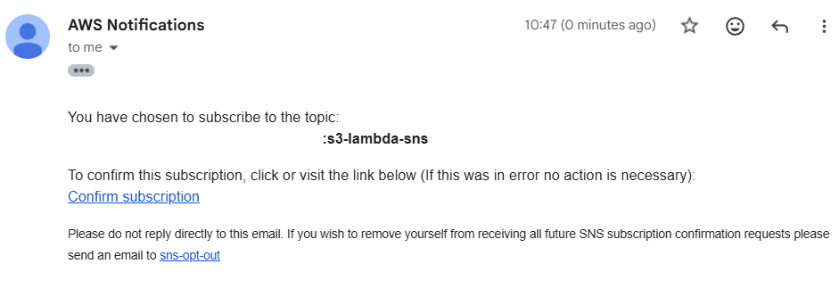
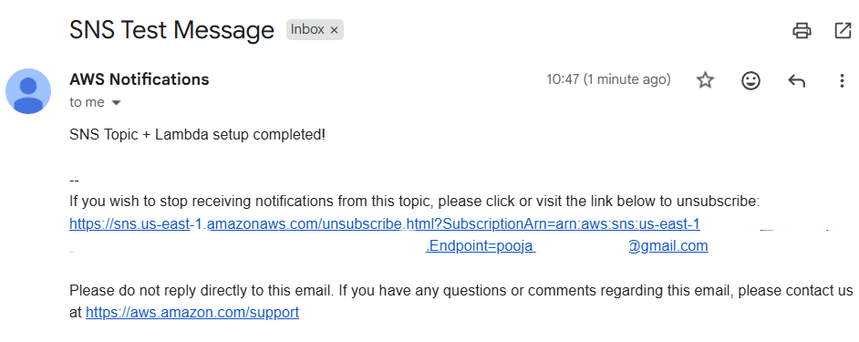

# 🗂️ **AWS S3 → Lambda → SNS Automation (Event-Driven Pipeline)**

This project demonstrates a fully automated, event-driven serverless architecture on AWS using:

- **Amazon S3** – Storage + event trigger  
- **AWS Lambda** – Processes uploaded files  
- **SNS (Simple Notification Service)** – Sends email alerts  
- **IAM** – Secure service access  
- **Bash Automation Script** – One-click deployment  

Whenever a file is uploaded to an S3 bucket, a Lambda function is triggered and sends an email notification via SNS.

---

# 🚀 Features

- Automatically creates:
  - IAM Role
  - S3 Bucket (with versioning)
  - Lambda Function
  - SNS Topic & Email Subscription
  - S3 → Lambda Trigger
- Idempotent script (safe to run multiple times)
- Automatically publishes SNS test message
- Supports AWS Free Tier
- Fully production-ready architecture

---

# 📌 Architecture Diagram



---

# 📁 Project Structure

```

aws-event-triggering/
│
├── s3-lambda-function/
│     ├── lambda_function.py
│     └── requirements.txt
│
├── s3-notification-triggers.sh   <-- main automation script
├── example_file.txt
└── function.zip  (created automatically)

````

---

# 📜 s3-notification-triggers.sh (Automation Script)

This script:

✔ Creates & configures IAM role  
✔ Creates S3 bucket  
✔ Enables versioning  
✔ Packages Lambda code  
✔ Creates or updates Lambda function  
✔ Adds bucket trigger  
✔ Creates SNS topic  
✔ Subscribes your email  
✔ Sends test notification  

Run it with:

```bash
chmod +x s3-notification-triggers.sh
./s3-notification-triggers.sh
````

---

# 🧪 Testing the Pipeline

Upload any test file:

```bash
aws s3 cp example_file.txt s3://pooja-free-tier-demo-2025/
```

You will receive an email notification:

```
File 'example_file.txt' was uploaded to bucket 'pooja-free-tier-demo-2025'
```

**Output**





---

# 🔧 Lambda Function Logic (Summary)

* Reads S3 event payload
* Extracts bucket name + file name
* Publishes a message to SNS
* Returns success JSON

---

# 📬 SNS Email Flow

1. SNS Topic created: `s3-lambda-sns`
2. Email address auto-subscribed
3. You must **confirm subscription** (AWS sends a link)
4. After confirmation → Email alerts active

---

# 🛡 IAM Permissions

Role gets:

* AWSLambdaBasicExecutionRole
* AmazonSNSFullAccess

This allows logging + SNS publishing.

---

# 🎯 Use Cases

* File upload notifications
* Audit logs
* Data engineering pipelines
* Automated document processing
* Event-driven applications

---

# 📌 Requirements

* AWS CLI configured
* IAM user with admin permissions
* Git Bash / Linux / macOS terminal

---

# 🧹 Cleanup (Optional)

To avoid extra billing, delete resources manually or use a delete script.

---

# 👨‍💻 Author

Project implemented & automated by **Pooja**
\
Built using real AWS infrastructure + Bash scripting.