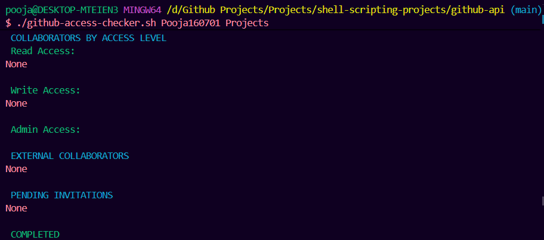

# 📘 GitHub Repository Access Checker

### *A Shell Script to List Read/Write/Admin Access for Any GitHub Repository*

This project provides a powerful **shell script** that uses the **GitHub REST API** to fetch detailed access information for any repository.
It helps DevOps engineers, security teams, and repository owners quickly view:

* ✔ Admin collaborators
* ✔ Write collaborators
* ✔ Read collaborators
* ✔ External collaborators
* ✔ Pending invitations
* ✔ Repository metadata (stars, forks, watchers, visibility)

The script supports **fine-grained GitHub Personal Access Tokens** and displays results in a clean, color-coded format.

---

# 🚀 Features

### 🔐 **Access Level Detection**

* Lists **Admin** users
* Lists **Write** users
* Lists **Read-only** collaborators
* Shows **external collaborators**
* Shows **pending invitations**

### 📊 **Repository Information**

* Repo visibility
* Star count
* Fork count
* Watcher count
* Repo name + validation
* Error handling for invalid repos or tokens

### 🛡 **Secure Authentication**

Uses GitHub Fine-Grained PAT (Personal Access Token) with minimal permissions:

* `Administration: Read`
* `Metadata: Read`

---

# 🔧 Prerequisites

### 1. Install `jq`

Used for parsing JSON responses.

**Ubuntu / WSL**

```bash
sudo apt install jq
```

**Mac**

```bash
brew install jq
```

**Windows (Git Bash)**
Git Bash includes jq if installed from package.
Otherwise: [https://stedolan.github.io/jq/](https://stedolan.github.io/jq/)

---

# 🔑 Create a GitHub Fine-Grained Token

1. Go to GitHub → Settings → Developer Settings → Fine-grained Tokens
2. Click **Generate new token**
3. Set permissions:

| Permission Type    | Level |
| ------------------ | ----- |
| **Administration** | Read  |
| **Metadata**       | Read  |

4. Select repositories you want the script to access
5. Copy your token (GitHub will NOT show it again)

---

# 🔐 Export Your GitHub Token & Username

```bash
export GITHUB_USERNAME="your-username"
export GITHUB_TOKEN="your-token-here"
```

Verify:

```bash
echo $GITHUB_USERNAME
echo $GITHUB_TOKEN
```

---

# ▶️ How to Run the Script

Make it executable:

```bash
chmod +x github-access-checker.sh
```

Run it with:

```bash
./github-access-checker.sh <repo-owner> <repo-name>
```

### Example:

```bash
./github-access-checker.sh Pooja160701 blockchain_glucometer
```

---

# Output



---

# 🛑 Error Handling

The script will handle:

* Invalid repositories
* Missing token
* Missing username
* Token without required permissions
* No collaborators present
* API rate limits
* Invalid arguments

---

# 🎯 Use Cases

* Security audits
* Repository access reviews
* Team onboarding validation
* CI/CD automation
* GitHub organization reporting
* DevOps portfolio projects

---

# 🌟 Future Enhancements (optional)

* Export report as **CSV / JSON / Markdown**
* Multi-repo scan mode
* GitHub Actions integration
* Branch protection rule checker
* HTML output report
* Auto-add / remove collaborators

---

# 👩‍💻 Author

**Pooja**
\
Shell Scripting • DevOps • GitHub API • AWS • Cloud Engineering