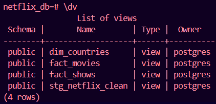
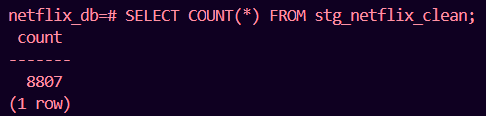
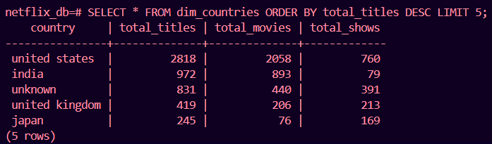
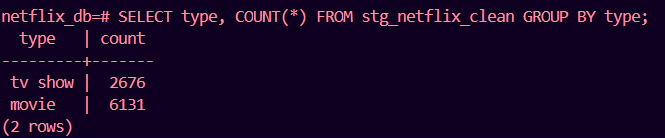

## 🧾 **Final README.md (with badges & polish)**

# 🎬 Data Engineering ETL Project — Netflix Titles (dbt + PostgreSQL)


A complete **SQL-based ETL pipeline** built using **dbt Core** and **PostgreSQL**, transforming the [Netflix Titles Dataset](https://www.kaggle.com/datasets/shivamb/netflix-shows) into analytics-ready fact and dimension models.  

This project simulates a real-world **data engineering workflow** — from raw CSV ingestion to cleaned staging and transformed marts — entirely using **SQL**.

---

## 🧠 **Project Overview**

### 🎯 Goal  
To build a modular, SQL-only ETL pipeline using **dbt** that:
- Cleans and standardizes raw Netflix data  
- Creates structured **fact** and **dimension** models  
- Enables analytical queries (e.g. content by country, type, and year)

### 🧰 Tools Used  
| Tool | Purpose |
|------|----------|
| **PostgreSQL** | Data warehouse for all models |
| **dbt Core** | Transformation layer for SQL models |
| **VS Code + Git** | Development and version control |
| **Kaggle Dataset** | Raw source data (Netflix titles) |

---

## 🧩 **Architecture**

### ETL Flow

```

Raw CSV (netflix_titles.csv)
│
▼
[ dbt seed ] → public.netflix_titles (raw table)
│
▼
[ dbt model: stg_netflix_clean ] → cleaned staging view
│
├── fact_movies
├── fact_shows
└── dim_countries

```

### Final Database Objects

| Layer | Object | Type | Description |
|--------|--------|------|-------------|
| Raw | `netflix_titles` | Table | Seeded from CSV |
| Staging | `stg_netflix_clean` | View | Cleaned, standardized records |
| Mart | `fact_movies` | View | Movie-only dataset |
| Mart | `fact_shows` | View | TV show-only dataset |
| Mart | `dim_countries` | View | Aggregation by country |

---

## 🗂️ **Repository Structure**

```

sql-etl-netflix/
┣ models/
┃ ┣ staging/
┃ ┃ ┗ stg_netflix_clean.sql
┃ ┗ marts/
┃    ┣ fact_movies.sql
┃    ┣ fact_shows.sql
┃    ┗ dim_countries.sql
┣ seeds/
┃ ┗ netflix_titles.csv
┣ dbt_project.yml
┣ .gitignore
┗ README.md

````

---

## ⚙️ **Setup Instructions**

### 1️⃣ Clone the Repository

```bash
git clone https://github.com/<your-username>/sql-etl-netflix.git
cd sql-etl-netflix
````

### 2️⃣ Configure PostgreSQL

Ensure PostgreSQL is installed and running locally:

```bash
psql -U postgres
CREATE DATABASE netflix_db;
```

### 3️⃣ Configure dbt Profile

Create or update your `profiles.yml` (in `C:\Users\<username>\.dbt\profiles.yml`):

```yaml
netflix_project:
  target: dev
  outputs:
    dev:
      type: postgres
      host: localhost
      user: postgres
      password: <password>
      port: 5432
      dbname: netflix_db
      schema: public
```

### 4️⃣ Run dbt Commands

```bash
# Verify connection
dbt debug

# Load raw CSV
dbt seed

# Build all models
dbt run
```

✅ **Expected Output:**

```
Done. PASS=4 WARN=0 ERROR=0 SKIP=0 NO-OP=0 TOTAL=4
```

---

## 🔍 **Verification in PostgreSQL**

Connect to PostgreSQL and confirm tables/views:

```bash
psql -U postgres -d netflix_db
```

```sql
\dt       -- list tables
\dv       -- list views
```

**Output**



### Sample Queries

```sql
-- Total records cleaned
SELECT COUNT(*) FROM stg_netflix_clean;

-- Top 5 countries by total content
SELECT * FROM dim_countries ORDER BY total_titles DESC LIMIT 5;

-- Content type breakdown
SELECT type, COUNT(*) FROM stg_netflix_clean GROUP BY type;
```

**Output**



**Output**



**Output**



---

## 📊 **Future Enhancements**

* Add **dbt tests** (`unique`, `not_null`) for data validation.
* Generate **dbt docs** using `dbt docs generate`.
* Visualize using **Metabase**, **Power BI**, or **Tableau**.
* Automate pipeline with **GitHub Actions** or **Airflow**.

---

## 👩‍💻 **Author**

**Pooja**
\
*Data Engineering & Analytics Enthusiast*