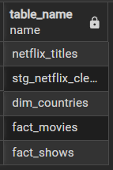
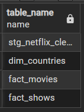
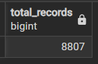
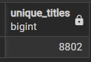
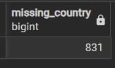
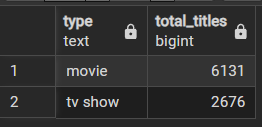
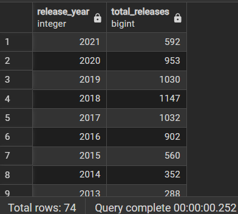
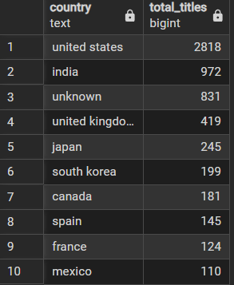
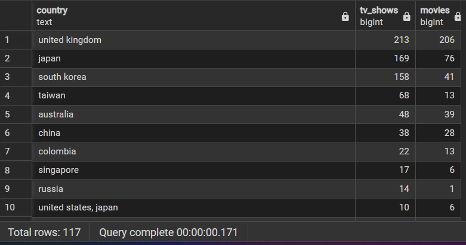

## ✅ SQL Commands

```sql
-- List all tables
SELECT table_name 
FROM information_schema.tables 
WHERE table_schema = 'public';
```

**Output:**



```sql
-- List all views
SELECT table_name 
FROM information_schema.views 
WHERE table_schema = 'public';
```

**Output:**



---

### 🔹 1. Basic Checks

```sql
SELECT COUNT(*) AS total_records FROM stg_netflix_clean;
```



```sql
SELECT COUNT(DISTINCT title) AS unique_titles FROM stg_netflix_clean;
```



```sql
SELECT COUNT(*) AS missing_country 
FROM stg_netflix_clean 
WHERE country IS NULL OR country = 'unknown';
```



---

### 🔹 2. Content Breakdown

```sql
-- Movies vs TV shows
SELECT type, COUNT(*) AS total_titles 
FROM stg_netflix_clean
GROUP BY type
ORDER BY total_titles DESC;
```



```sql
-- Titles released per year
SELECT release_year, COUNT(*) AS total_releases
FROM stg_netflix_clean
GROUP BY release_year
ORDER BY release_year DESC;
```



---

### 🔹 3. Country Insights

```sql
-- Top 10 countries by number of titles
SELECT country, COUNT(*) AS total_titles
FROM stg_netflix_clean
GROUP BY country
ORDER BY total_titles DESC
LIMIT 10;
```



```sql
-- Countries producing more TV shows than movies
SELECT country,
       SUM(CASE WHEN type = 'tv show' THEN 1 ELSE 0 END) AS tv_shows,
       SUM(CASE WHEN type = 'movie' THEN 1 ELSE 0 END) AS movies
FROM stg_netflix_clean
GROUP BY country
HAVING SUM(CASE WHEN type = 'tv show' THEN 1 ELSE 0 END) >
       SUM(CASE WHEN type = 'movie' THEN 1 ELSE 0 END)
ORDER BY tv_shows DESC;
```



---

### 🔹 4. Genre & Category

```sql
-- Top 10 genres
SELECT TRIM(SPLIT_PART(listed_in, ',', 1)) AS genre,
       COUNT(*) AS total
FROM stg_netflix_clean
GROUP BY genre
ORDER BY total DESC
LIMIT 10;

-- Genre split for movies
SELECT TRIM(SPLIT_PART(listed_in, ',', 1)) AS genre,
       COUNT(*) AS movie_count
FROM stg_netflix_clean
WHERE type = 'movie'
GROUP BY genre
ORDER BY movie_count DESC
LIMIT 10;

-- Genre split for TV shows
SELECT TRIM(SPLIT_PART(listed_in, ',', 1)) AS genre,
       COUNT(*) AS show_count
FROM stg_netflix_clean
WHERE type = 'tv show'
GROUP BY genre
ORDER BY show_count DESC
LIMIT 10;
```

---

### 🔹 5. Director & Cast

```sql
-- Top 10 directors by title count
SELECT director, COUNT(*) AS total_titles
FROM stg_netflix_clean
WHERE director <> 'not specified'
GROUP BY director
ORDER BY total_titles DESC
LIMIT 10;

-- Titles with missing director
SELECT COUNT(*) AS missing_director
FROM stg_netflix_clean
WHERE director = 'not specified';
```

---

### 🔹 6. Ratings & Maturity

```sql
-- Top maturity ratings
SELECT rating, COUNT(*) AS total_titles
FROM stg_netflix_clean
GROUP BY rating
ORDER BY total_titles DESC
LIMIT 10;

-- Countries producing most 'TV-MA' content
SELECT country, COUNT(*) AS tv_ma_titles
FROM stg_netflix_clean
WHERE rating = 'TV-MA'
GROUP BY country
ORDER BY tv_ma_titles DESC
LIMIT 10;
```

---

### 🔹 7. Time Trends

```sql
-- Titles added to Netflix per year
SELECT EXTRACT(YEAR FROM date_added)::int AS year_added, COUNT(*) AS total_titles
FROM stg_netflix_clean
WHERE date_added IS NOT NULL
GROUP BY year_added
ORDER BY year_added DESC;

-- Titles added per month
SELECT TO_CHAR(date_added, 'YYYY-MM') AS month_added, COUNT(*) AS total
FROM stg_netflix_clean
WHERE date_added IS NOT NULL
GROUP BY month_added
ORDER BY month_added DESC;
```

---

### 🔹 8. Country-Level Dimension (from dbt model)

```sql
-- Check aggregated country dimension
SELECT * FROM dim_countries ORDER BY total_titles DESC LIMIT 10;

-- Compare movies vs shows by country
SELECT country, total_movies, total_shows
FROM dim_countries
ORDER BY total_titles DESC
LIMIT 10;
```

---

### 🔹 9. Advanced Analytics (Optional)

```sql
-- Year-over-year content growth
WITH yearly AS (
  SELECT release_year, COUNT(*) AS total
  FROM stg_netflix_clean
  GROUP BY release_year
)
SELECT release_year,
       total,
       LAG(total) OVER (ORDER BY release_year) AS prev_year,
       ROUND(((total::numeric - LAG(total) OVER (ORDER BY release_year)) / 
              NULLIF(LAG(total) OVER (ORDER BY release_year), 0)) * 100, 2) AS growth_rate
FROM yearly
ORDER BY release_year;

-- Content by decade
SELECT (release_year/10)*10 AS decade, COUNT(*) AS total_titles
FROM stg_netflix_clean
GROUP BY decade
ORDER BY decade;
```